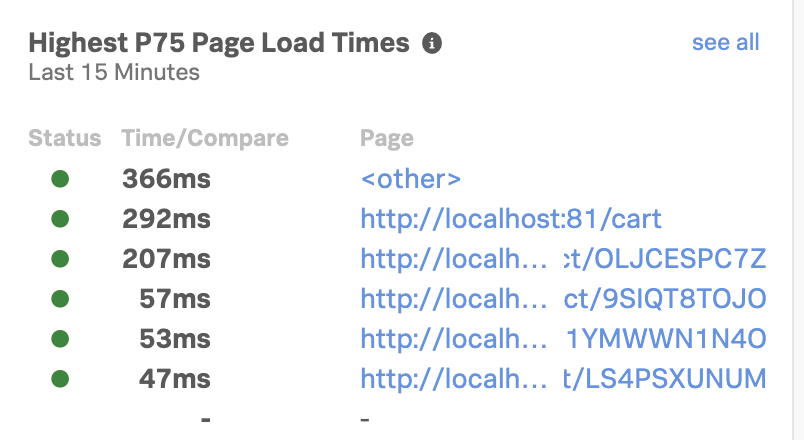

# Readme

In order to generate RUM data in Splunk RUM it is recommended that the workshop host deploys a RUM instrumented version of the Online Boutique. The workshop host will then have the attendees visit the site to generate RUM traffic (and APM traces/spans).

## Deploying RUM enabled Online Boutique

```bash
cd ~/workshop/apm/microservices-demo/k8s
export RUM_TOKEN=<SPLUNK_RUM_TOKEN>
./rum-config.sh
```

Check that the overwritten `deployment.yaml` contains the correct RUM settings (the `RUM_APP_NAME` and `RUM_ENVIRONMENT` will be prefixed with your EC2 instance hostname) e.g.:

```yaml
- name: RUM_REALM
  value: eu0
- name: RUM_AUTH
  value: abc123
- name: RUM_APP_NAME
  value: redu-rum-app
- name: RUM_ENVIRONMENT
  value: redu-rum-env
```

If all looks correct, run the deployment:

```bash
kubectl apply -f deployment.yaml

```

Wait till all the pods have loaded, to ensure the Online Boutique application is running:

```bash

    kubectl get pods
```

!!! info
    Usually it should only take around 1min 30secs for the pods to transition into a Running state.

Once they are in a running state open a separate terminal  and start the script to get the initial load in the system


```bash
     cd ~/workshop/apm/microservices-demo/k8s
    node touchwebsite.js  > A.log &
    node touchwebsite.js  > B.log &
    node touchwebsite.js  > C.log & 
```
You can verify if the application runs correctly as it should start running across and interacting with the Online Boutique
You can run more of the above load scripts to generate more sessions.

The result  in the logs should be a number of actions in the various logs indicatin actions towards the website to pre-load the workshop:

```text

    Product found in the shop: Vintage Typewriter
    Product found in the shop: City Bike
    Product found in the shop: Home Barista Kit
    Product found in the shop: Metal Camping Mug
    Total Price: USD 1017.03
     checkout clicked
    order: e15f5ce7-34c3-11ec-9543-16134fe48367
    cookies was
    Before:  shop_session-id
    Before:  _splunk_rum_sid
    After:  shop_session-id

```    
If you verify the RUM  overview pag and it show only urls for ***other*** as shown below,
keep the above scripts running for approximately 10 minutes 


 !!!!! 
Wait until you see the urls for localhost  as shown below appear in the RUM overview ,  before starting with the RUM Workshop


