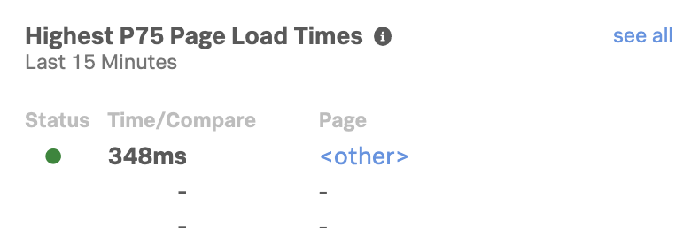

# Readme

In order to generate RUM data in Splunk RUM it is recommended that the workshop host deploys a RUM instrumented version of the Online Boutique. The workshop host will then have the attendees visit the site to generate RUM traffic (and APM traces/spans).

## Deploying RUM enabled Online Boutique

```bash
cd ~/workshop/apm/microservices-demo/k8s
export RUM_TOKEN=<SPLUNK_RUM_TOKEN>
./rum-config.sh
```

This will create a separate deployment Kubernetes Manifest called deploymentRUM.yaml
Check that the created `deploymentRUM.yaml` contains the correct RUM settings (the `RUM_APP_NAME` and `RUM_ENVIRONMENT` will be prefixed with your EC2 instance hostname) e.g.:

```yaml
- name: RUM_REALM
  value: eu0
- name: RUM_AUTH
  value: abc123
- name: RUM_APP_NAME
  value: redu-rum-app
- name: RUM_ENVIRONMENT
  value: redu-rum-env
```

If all looks correct, run the deployment:

```bash
kubectl apply -f deploymentRUM.yaml

```

Wait till all the pods have loaded, to ensure the Online Boutique application is running:

```bash

    kubectl get pods
```

!!! info
    Usually it should only take around 1min 30secs for the pods to transition into a Running state.

Once they are in a running state you need to wait several minutes  to get all the services started and the demo is stabilized.

If you verify the RUM  overview page and it show only urls for ***other*** as shown below,  the RUM backend is still processing requests and wait approximately 10 minutes. to make sure all is settled before starting showing RUM



 !!!!! 
Wait until you see the urls with proper IP-addresses or localhost as shown below appear in the RUM overview , before starting with the RUM Workshop


