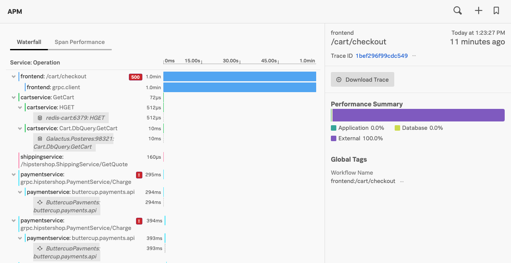
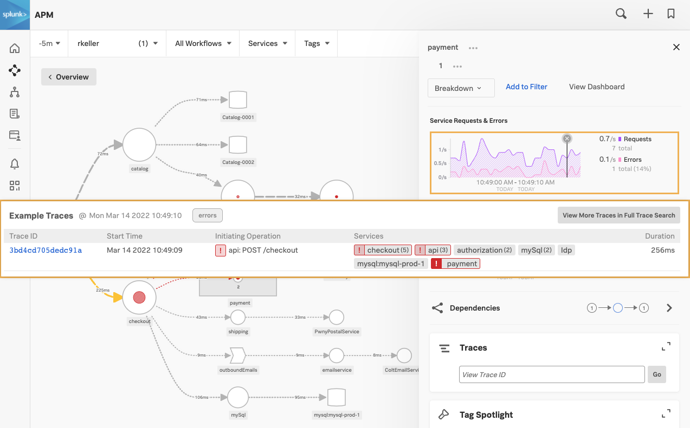
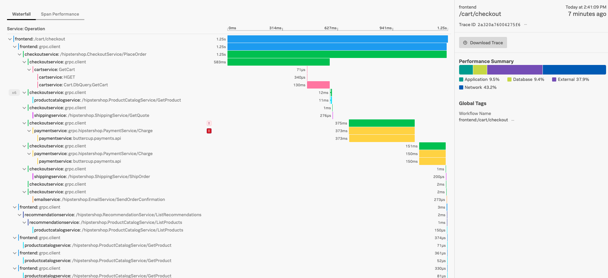

* APM Overview - RED metrics
* Using the Service Map
* Introduction to Tag Spotlight
* Example Traces
* Contextual Links to Infra

## 1. Traces and Spans explained

A trace is a collection of spans that share the same trace ID, representing a unique transaction handled by your application and its constituent services.

Each span has a name, representing the operation captured by this span, and a service name, representing within which service the operation took place.

Additionally, spans may reference another span as their parent, defining the relationships between the operations captured in the trace that were performed to process that transaction.

Each span contains a lot of information about the method, operation, or block of code that it captures, including:

* the operation name
* the start time of the operation with microsecond precision
* how long the operation took to execute, also with microsecond precision
* the logical name of the service on which the operation took place
* the IP address of the service instance on which the operation took place

## 2. Service Map

Click on **paymentservice** in the service map and select **version** from the breakdown drop down filter underneath **paymentservice**. This will filter our service map by the custom span tag **version**.

You will now see the service map has been updated like the below screenshot to show the different versions of the **paymentservice**.

## 3. Tag Spotlight

On the right hand side of the screen scroll down on **Tag Spotlight** and select **Top Across All Indexed Tags** from the dropdown. Once this has been selected click the arrows as indicated in the screenshot below.

The Tag Spotlight Page will be displayed. From this page you can view the top tags in your application and their corresponding error rates and request rates.

Note that for the **version** span tag it appears that version `350.10` has a 100% error rate and for our **tenant.level** span tag it shows that all three tenants (Gold, Silver & Bronze) have errors present.

The Tag Spotlight page is interactive and allows you to add a tag as a filter by simply clicking on your desired tag. Click on **gold** under **tenant.level** to add it as a filter. Once this is done the page will now only display data with **gold** as it’s **tenant.level**.

Tag Spotlight is very useful for analysing your data and spotting trends. We can see that for the Gold Tenant that out of the total number of requests, 55 of them are in error.

If we correlate this to the version tag, we can see that version `350.10` served 55 requests and version `350.9` served 17 requests. This means that all of the requests that went through version `350.10` ended up in an error state.

In order to test this theory further that all of the requests from **paymentservice** version `350.10` result in an error, we can change our filter to another tenant by using the tag selector. Change your filter from **gold** tenant to **silver** tenant.

Now we can perform a similar analysis by looking at the number of requests in error for the **silver** tenant and correlating that with the version number. Note the amount of errors for the **silver** tenant match the amount of requests for version `350.10`.  

Tag Spotlight not only allows you to look at request and error rates but also at the latency per service. In order to do this just select the latency button and remove your Silver Tenant Tag so that you can see the latency for all of the Payment Service.

Go back to your service map by pressing the X button on the far right underneath **Clear All**.

Click anywhere on the pink line in the ‘Service Requests & Errors’ graph. Once selected you should see a list of example traces. Click on one of the example traces.

## 4. Example Trace

You should now see the entire trace along with the spans for the example trace that was selected. Spans which have errors are indicated by a red exclamation mark beside it.

 Click one of these to expand the span and see the associated metadata and some error details. Note that we are able to see that this error is caused by a 401 error and other useful information such as ‘tenant’ and ‘version’ is also displayed.

