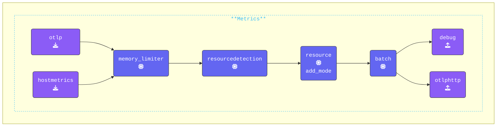

{}

**Add the `otlphttp` exporter**: The [**OTLP/HTTP Exporter**](https://help.splunk.com/en/splunk-observability-cloud/manage-data/splunk-distribution-of-the-opentelemetry-collector/get-started-with-the-splunk-distribution-of-the-opentelemetry-collector/collector-components/exporters/otlphttp-exporter) is used to send data from the agent to the gateway using the **OTLP/HTTP** protocol.

1. Switch to your **Agent terminal** window.
2. Validate that the newly generated `gateway-logs.out`, `gateway-metrics.out`, and `gateway-traces.out` are present in the directory.
3. Open the `agent.yaml` file in your editor.
4. Add the `otlphttp` exporter configuration to the `exporters:` section:

```yaml
  otlphttp:                            # Exporter Type
    endpoint: "http://localhost:5318"  # Gateway OTLP endpoint
```

**Add a Batch Processor configuration**: The [**Batch Processor**](https://github.com/open-telemetry/opentelemetry-collector/blob/main/processor/batchprocessor/README.md) will accept spans, metrics, or logs and place them into batches. Batching helps better compress the data and reduce the number of outgoing connections required to transmit the data. It is highly recommended configuring the batch processor on every collector.

1. Add the `batch` processor configuration to the `processors:` section:

```yaml
  batch:                               # Processor Type
```

**Update the pipelines**:

1. **Enable Hostmetrics Receiver**:
    - Add `hostmetrics` to the `metrics` pipeline. The [**HostMetrics Receiver**](https://github.com/open-telemetry/opentelemetry-collector-contrib/tree/main/receiver/hostmetricsreceiver#readme) will generate host CPU metrics once per hour with the current configuration.
2. **Enable Batch Processor**:
    - Add the `batch` processor (after the `resource/add_mode` processor) to the `traces`, `metrics`, and `logs` pipelines.
3. **Enable OTLPHTTP Exporter**:
    - Add the `otlphttp` exporter to the `traces`, `metrics`, and `logs` pipelines.

```yaml
  pipelines:
    traces:
      receivers:
      - otlp                           # OTLP Receiver
      processors:
      - memory_limiter                 # Memory Limiter processor
      - resourcedetection              # Add system attributes to the data
      - resource/add_mode              # Add collector mode metadata
      - batch                          # Batch processor
      exporters:
      - debug                          # Debug Exporter
      - file                           # File Exporter
      - otlphttp                       # OTLP/HTTP Exporter
    metrics:
      receivers:
      - otlp
      - hostmetrics                    # Host Metrics Receiver
      processors:
      - memory_limiter
      - resourcedetection
      - resource/add_mode
      - batch
      exporters:
      - debug
      - otlphttp
    logs:
      receivers:
      - otlp
      processors:
      - memory_limiter
      - resourcedetection
      - resource/add_mode
      - batch
      exporters:
      - debug
      - otlphttp
```

{}

Validate the agent configuration using **[otelbin.io](https://www.otelbin.io/)**. For reference, the `metrics:` section of your pipelines will look similar to this:


