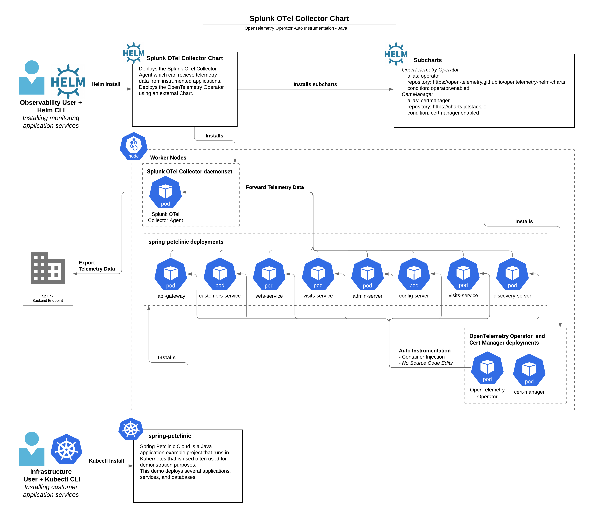

We will show the steps about how to clone (download) a sample microservices Java application (Spring PetClinic), as well as how to compile, package and deploy/run the application.

Once the application is up and running, we will examine the default metrics sent by the Opentelemetry Collector in the **Splunk Observability UI** Next, when auto instrumentation is enabled we will start seeing metrics and traces created via the **Auto Instrumentation** for Java that will be used by the **Splunk APM** product.

We also will examine Always-on Profiling and Database Query performance.

<!--  to be completed in version 2.0
After that, we will instrument PetClinic's end user interface (HTML pages rendered by the application) with the **Splunk OpenTelemetry Javascript Libraries (RUM)** that will generate RUM traces around all the individual clicks and page loads executed by an end user.
-->

Lastly, we will configure the Spring PetClinic application to inject trace information into the application logs and send them to **Splunk Cloud**.

{}

* Outbound SSH access to port `2222`.
* Outbound HTTP access to port `81`.
* Familiarity with the `bash` shell and `vi/vim/nano` editor.

{}

---
Based on the [example](https://github.com/signalfx/splunk-otel-collector-chart/blob/main/examples/enable-operator-and-auto-instrumentation/spring-petclinic-java.md) **Josh Voravong** has created.
