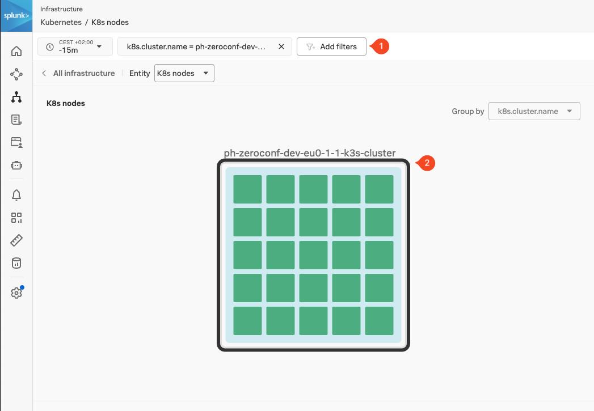
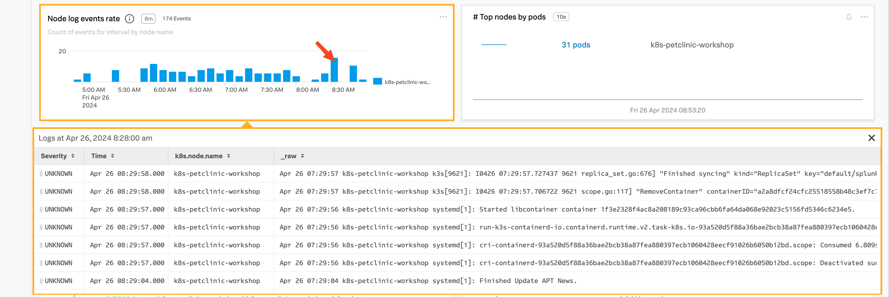

Once the installation has been completed, you can log in to **Splunk Observability Cloud** and verify that the metrics are flowing in from your Kubernetes cluster.

From the left-hand menu click on **Infrastructure**  and select **Kubernetes**, then select the **K8s nodes** pane. Once you are in the **K8s nodes** view, change the **Time** filter from **-4h** to the last 15 minutes **(-15m)** to focus on the latest data.

Next, click **Add filters** (next to the **Time filter**) and add the filter `k8s.cluster.name` **(1)**. Type or select the cluster name of your workshop instance (you can get the unique part from your cluster name by using the `INSTANCE` from the output from the shell script you ran earlier). You can also select your cluster by clicking on its image in the cluster pane. You will now only have your cluster visible **(2)**.

Scroll down the page to see the metrics coming in from your cluster. Locate the **Node log events rate** chart and click on a vertical bar to see the log entries coming in from your cluster.

