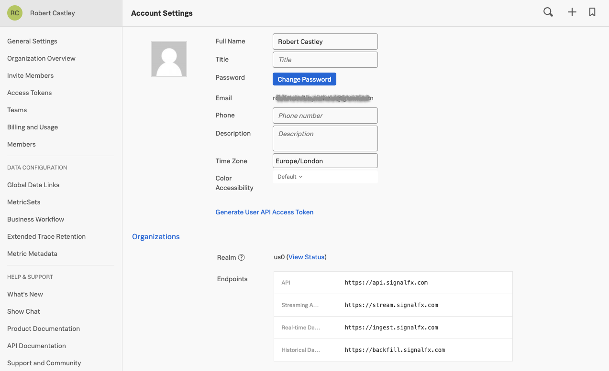

* Use the Splunk Helm chart to install the OpenTelemetry Collector in K3s
* Explore your cluster in the Kubernetes Navigator

---

## 1. Obtain Access Token

You will need to obtain your Access Token[^1] from the Splunk UI. You can find the workshop Access Token by clicking **>>** bottom left and then selecting **Settings → Access Tokens**.

Expand the workshop token that your host has instructed you to use e.g. **O11y-Workshop-ACCESS**, then click on **Show Token** to expose your token. Click the {}Copy{} button to copy to clipboard. Please do not use the **Default** token!

{}
We have created a Token specifically for this workshop with the appropriate settings for the exercises you will be performing so have allocated it both Ingest and API Permissions.  Best practice in production is to only allocate a single permission to a Token such as Ingest OR API OR RUM and use multiple Tokens where required.
{}

You will also need to obtain the name of the Realm[^2] for your Splunk account.  At the top of the side menu, click on your name. This will direct you to the **Account Settings** Page. Click the **Organizations**-tab. The Realm can be found at the top of the displayed information in the tab.  In this example it is `eu0`.

## 2. Installation using Helm

Create the `ACCESS_TOKEN` and `REALM` environment variables to use in the proceeding Helm install command. For instance, if your realm is `us1`, you would type `export REALM=us1` and for `eu0` type `export REALM=eu0`.



export ACCESS_TOKEN="<replace_with_O11y-Workshop-ACCESS_TOKEN>"





export REALM="<replace_with_REALM>"



Install the OpenTelemetry Collector using the Splunk Helm chart. First, add the Splunk Helm chart repository to Helm and update.


helm repo add splunk-otel-collector-chart https://signalfx.github.io/splunk-otel-collector-chart && helm repo update


Using ACCESS_TOKEN={REDACTED}
Using REALM=eu0
"splunk-otel-collector-chart" has been added to your repositories
Using ACCESS_TOKEN={REDACTED}
Using REALM=eu0
Hang tight while we grab the latest from your chart repositories...
...Successfully got an update from the "splunk-otel-collector-chart" chart repository
Update Complete. ⎈Happy Helming!⎈



Install the OpenTelemetry Collector Helm chart with the following commands, do **NOT** edit this:



helm install splunk-otel-collector \
--set="splunkObservability.realm=$REALM" \
--set="splunkObservability.accessToken=$ACCESS_TOKEN" \
--set="clusterName=$(hostname)-k3s-cluster" \
--set="splunkObservability.logsEnabled=true" \
--set="splunkObservability.profilingEnabled=true" \
--set="splunkObservability.infrastructureMonitoringEventsEnabled=true" \
--set="environment=$(hostname)-apm-env" \
splunk-otel-collector-chart/splunk-otel-collector \
-f ~/workshop/k3s/otel-collector.yaml


helm install splunk-otel-collector --set="splunkObservability.realm=$REALM" --set="splunkObservability.accessToken=$ACCESS_TOKEN" --set="clusterName=$(hostname)-k3s-cluster" --set="splunkObservability.logsEnabled=true" --set="splunkObservability.profilingEnabled=true" --set="environment=$(hostname)-apm-env" splunk-otel-collector-chart/splunk-otel-collector -f ~/workshop/k3s/otel-collector.yaml


Using ACCESS_TOKEN={REDACTED}
Using REALM=eu0
NAME: splunk-otel-collector
LAST DEPLOYED: Fri May  7 11:19:01 2021
NAMESPACE: default
STATUS: deployed
REVISION: 1
TEST SUITE: None



You can monitor the progress of the deployment by running `kubectl get pods` which should typically report a new pod is up and running after about 30 seconds.

Ensure the status is reported as Running before continuing.



kubectl get pods


NAME                                                          READY   STATUS    RESTARTS   AGE
splunk-otel-collector-agent-2sk6k                             0/1     Running   0          10s
splunk-otel-collector-k8s-cluster-receiver-6956d4446f-gwnd7   0/1     Running   0          10s



Ensure there are no errors by tailing the logs from the OpenTelemetry Collector pod. Output should look similar to the log output shown in the Output tab below.

Use the label set by the `helm` install to tail logs (You will need to press `ctrl+c` to exit). Or use the installed `k9s` terminal UI for bonus points!



kubectl logs -l app=splunk-otel-collector -f --container otel-collector


2021-03-21T16:11:10.900Z        INFO    service/service.go:364  Starting receivers...
2021-03-21T16:11:10.900Z        INFO    builder/receivers_builder.go:70 Receiver is starting... {"component_kind": "receiver", "component_type": "prometheus", "component_name": "prometheus"}
2021-03-21T16:11:11.009Z        INFO    builder/receivers_builder.go:75 Receiver started.       {"component_kind": "receiver", "component_type": "prometheus", "component_name": "prometheus"}
2021-03-21T16:11:11.009Z        INFO    builder/receivers_builder.go:70 Receiver is starting... {"component_kind": "receiver", "component_type": "k8s_cluster", "component_name": "k8s_cluster"}
2021-03-21T16:11:11.009Z        INFO    k8sclusterreceiver@v0.21.0/watcher.go:195       Configured Kubernetes MetadataExporter  {"component_kind": "receiver", "component_type": "k8s_cluster", "component_name": "k8s_cluster", "exporter_name": "signalfx"}
2021-03-21T16:11:11.009Z        INFO    builder/receivers_builder.go:75 Receiver started.       {"component_kind": "receiver", "component_type": "k8s_cluster", "component_name": "k8s_cluster"}
2021-03-21T16:11:11.009Z        INFO    healthcheck/handler.go:128      Health Check state change       {"component_kind": "extension", "component_type": "health_check", "component_name": "health_check", "status": "ready"}
2021-03-21T16:11:11.009Z        INFO    service/service.go:267  Everything is ready. Begin running and processing data.
2021-03-21T16:11:11.009Z        INFO    k8sclusterreceiver@v0.21.0/receiver.go:59       Starting shared informers and wait for initial cache sync.      {"component_kind": "receiver", "component_type": "k8s_cluster", "component_name": "k8s_cluster"}
2021-03-21T16:11:11.281Z        INFO    k8sclusterreceiver@v0.21.0/receiver.go:75       Completed syncing shared informer caches.       {"component_kind": "receiver", "component_type": "k8s_cluster", "component_name": "k8s_cluster"}



{}
If you make an error installing the OpenTelemetry Collector you can start over by deleting the installation using:
`helm delete splunk-otel-collector`
{}

---

## 3. Validate metrics in the UI

In the Splunk UI, click the **>>** bottom left and click on **Infrastructure**.

Under **Containers** click on **Kubernetes** and select in right hand menu **k8s nodes** to open the Kubernetes Navigator Cluster Map and ensure metrics are being sent in.

Validate that your cluster is discovered and reporting by finding your cluster (in the workshop you will see many other clusters). To find your cluster name run the following command and copy the output to your clipboard:



echo $(hostname)-k3s-cluster



Then in the UI, click on the **Add Filter** menu and start typing **cluster**, the filter will automatically populate matching results and select **k8s.cluster.name**, paste the Cluster name you just copied into the search box, click the box to select your cluster, and finally click apply filter.

To examine the health of your node, hover over the pale blue background of your cluster, then click on the blue magnifying glass  that appears in the top left hand corner.

This will drill down to the node level.  Next, open the side bar by clicking on the side bar button to open the Metrics side bar.

Once it is open, you can use the slider on the side to explore the various charts relevant to your cluster/node: CPU, Memory, Network, Events etc.

[^1]: Access Tokens (sometimes called Org Tokens) are long-lived organization-level tokens. By default, these tokens persist for 5 years, and thus are suitable for embedding into emitters that send data points over long periods of time, or for any long-running scripts that call the Splunk API.

[^2]: A realm is a self-contained deployment of Splunk in which your Organization is hosted. Different realms have different API endpoints (e.g. the endpoint for sending data is `ingest.us1.signalfx.com` for the **`us1`** realm, and `ingest.eu0.signalfx.com` for the **`eu0`** realm). This realm name is shown on your profile page in the Splunk UI. If you do not include the realm name when specifying an endpoint, Splunk will interpret it as pointing to the **`us0`** realm.
