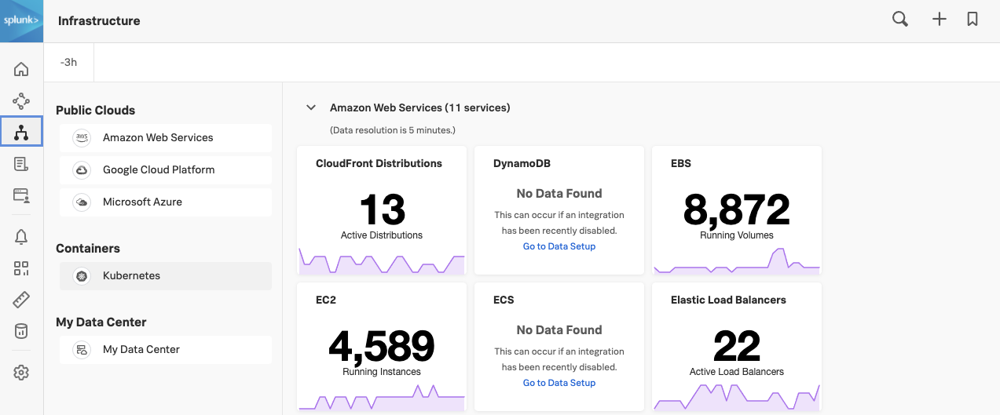
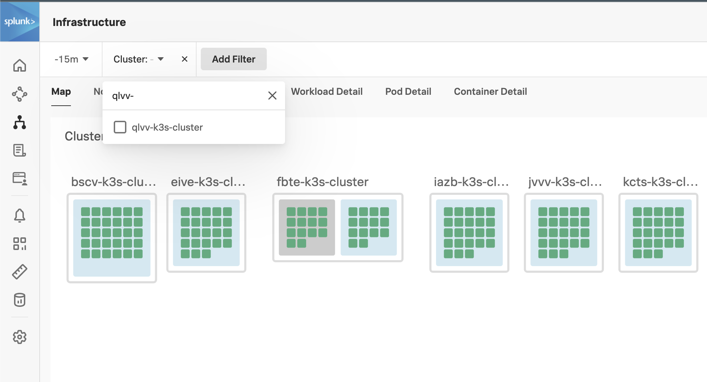
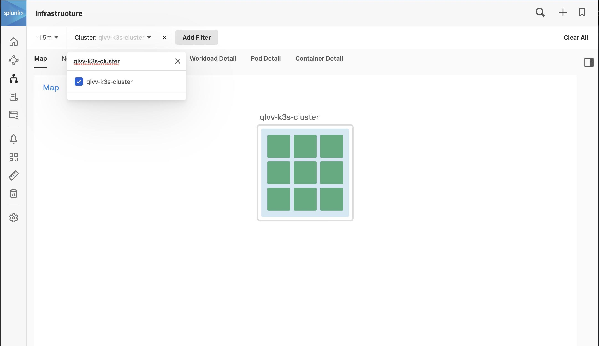
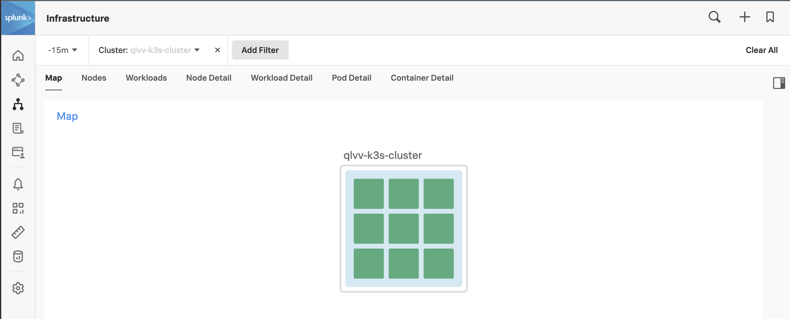

{}15 minutes{}

* Use the Splunk Helm chart to install the OpenTelemetry Collector in K3s
* Explore your cluster in the Kubernetes Navigator

---

## 1. Installation using Helm

Install the OpenTelemetry Collector using the Splunk Helm chart. First, add the Splunk Helm chart repository to Helm and update:


{}

``` bash
helm repo add splunk-otel-collector-chart https://signalfx.github.io/splunk-otel-collector-chart && helm repo update
```

{}
{}
Using ACCESS_TOKEN={REDACTED}
Using REALM=eu0
"splunk-otel-collector-chart" has been added to your repositories
Using ACCESS_TOKEN={REDACTED}
Using REALM=eu0
Hang tight while we grab the latest from your chart repositories...
...Successfully got an update from the "splunk-otel-collector-chart" chart repository
Update Complete. ⎈Happy Helming!⎈
{}


Install the OpenTelemetry Collector Helm chart with the following commands, do **NOT** edit this:


{}

```bash
helm install splunk-otel-collector \
--set="splunkObservability.realm=$REALM" \
--set="splunkObservability.accessToken=$ACCESS_TOKEN" \
--set="clusterName=$INSTANCE-k3s-cluster" \
--set="splunkObservability.logsEnabled=false" \
--set="logsEngine=otel" \
--set="splunkObservability.profilingEnabled=true" \
--set="splunkObservability.infrastructureMonitoringEventsEnabled=true" \
--set="environment=$INSTANCE-workshop" \
--set="splunkPlatform.endpoint=$HEC_URL" \
--set="splunkPlatform.token=$HEC_TOKEN" \
--set="splunkPlatform.index=splunk4rookies-workshop" \
splunk-otel-collector-chart/splunk-otel-collector \
-f ~/workshop/k3s/otel-collector.yaml

```
<!--
```bash
helm install splunk-otel-collector \
--set="splunkObservability.realm=$REALM" \
--set="splunkObservability.accessToken=$ACCESS_TOKEN" \
--set="clusterName=$INSTANCE-k3s-cluster" \
--set="splunkObservability.logsEnabled=true" \
--set="logsEngine=otel" \
--set="splunkObservability.profilingEnabled=true" \
--set="splunkObservability.infrastructureMonitoringEventsEnabled=true" \
--set="environment=$INSTANCE-workshop" \
splunk-otel-collector-chart/splunk-otel-collector \
-f ~/workshop/k3s/otel-collector.yaml
```
-->
{}
{}

``` text
Using ACCESS_TOKEN={REDACTED}
Using REALM=eu0
NAME: splunk-otel-collector
LAST DEPLOYED: Fri May  7 11:19:01 2021
NAMESPACE: default
STATUS: deployed
REVISION: 1
TEST SUITE: None
```

{}


You can monitor the progress of the deployment by running `kubectl get pods` which should typically report a new pod is up and running after about 30 seconds.

Ensure the status is reported as Running before continuing.


{}

``` bash
kubectl get pods
```

{}
{}

``` text
NAME                                                          READY   STATUS    RESTARTS   AGE
splunk-otel-collector-agent-2sk6k                             0/1     Running   0          10s
splunk-otel-collector-k8s-cluster-receiver-6956d4446f-gwnd7   0/1     Running   0          10s
```

{}


Ensure there are no errors by tailing the logs from the OpenTelemetry Collector pod. The output should look similar to the log output shown in the Output tab below.

Use the label set by the `helm` install to tail logs (You will need to press `ctrl+c` to exit). Or use the installed `k9s` terminal UI for bonus points!


{}

``` bash
kubectl logs -l app=splunk-otel-collector -f --container otel-collector
```

{}
{}
2021-03-21T16:11:10.900Z        INFO    service/service.go:364  Starting receivers...
2021-03-21T16:11:10.900Z        INFO    builder/receivers_builder.go:70 Receiver is starting... {"component_kind": "receiver", "component_type": "prometheus", "component_name": "prometheus"}
2021-03-21T16:11:11.009Z        INFO    builder/receivers_builder.go:75 Receiver started.       {"component_kind": "receiver", "component_type": "prometheus", "component_name": "prometheus"}
2021-03-21T16:11:11.009Z        INFO    builder/receivers_builder.go:70 Receiver is starting... {"component_kind": "receiver", "component_type": "k8s_cluster", "component_name": "k8s_cluster"}
2021-03-21T16:11:11.009Z        INFO    k8sclusterreceiver@v0.21.0/watcher.go:195       Configured Kubernetes MetadataExporter  {"component_kind": "receiver", "component_type": "k8s_cluster", "component_name": "k8s_cluster", "exporter_name": "signalfx"}
2021-03-21T16:11:11.009Z        INFO    builder/receivers_builder.go:75 Receiver started.       {"component_kind": "receiver", "component_type": "k8s_cluster", "component_name": "k8s_cluster"}
2021-03-21T16:11:11.009Z        INFO    healthcheck/handler.go:128      Health Check state change       {"component_kind": "extension", "component_type": "health_check", "component_name": "health_check", "status": "ready"}
2021-03-21T16:11:11.009Z        INFO    service/service.go:267  Everything is ready. Begin running and processing data.
2021-03-21T16:11:11.009Z        INFO    k8sclusterreceiver@v0.21.0/receiver.go:59       Starting shared informers and wait for initial cache sync.      {"component_kind": "receiver", "component_type": "k8s_cluster", "component_name": "k8s_cluster"}
2021-03-21T16:11:11.281Z        INFO    k8sclusterreceiver@v0.21.0/receiver.go:75       Completed syncing shared informer caches.       {"component_kind": "receiver", "component_type": "k8s_cluster", "component_name": "k8s_cluster"}
{}


{}
If you make an error installing the OpenTelemetry Collector you can start over by deleting the installation using:

``` sh
helm delete splunk-otel-collector
```

{}

---

## 2. Validate metrics in the UI

In the Splunk UI, click the **>>** bottom left and click on **Infrastructure**.



Under **Containers** click on **Kubernetes** to open the Kubernetes Navigator Cluster Map to ensure metrics are being sent in.

Validate that your cluster is discovered and reported by finding your cluster (in the workshop you will see many other clusters). To find your cluster name run the following command and copy the output to your clipboard:

{}

```bash
echo $INSTANCE-k3s-cluster
```

{}

Then in the UI, click on the "Cluster: - " menu just below the Splunk Logo, and paste the Cluster name you just copied into the search box, click the box to select your cluster, and finally click off the menu into white space to apply the filter.







To examine the health of your node, hover over the pale blue background of your cluster, then click on the blue magnifying glass  that appears in the top left-hand corner.

This will drill down to the node level.  Next, open the Metrics sidebar by clicking on the sidebar button.

Once it is open, you can use the slider on the side to explore the various charts relevant to your cluster/node: CPU, Memory, Network, Events etc.


[^1]: Access Tokens (sometimes called Org Tokens) are long-lived organization-level tokens. By default, these tokens persist for 5 years, and thus are suitable for embedding into emitters that send data points over long periods of time, or for any long-running scripts that call the Splunk API.

[^2]: A realm is a self-contained deployment of Splunk in which your Organization is hosted. Different realms have different API endpoints (e.g. the endpoint for sending data is `ingest.us1.signalfx.com` for the **`us1`** realm, and `ingest.eu0.signalfx.com` for the **`eu0`** realm). This realm name is shown on your profile page in the Splunk UI. If you do not include the realm name when specifying an endpoint, Splunk will interpret it as pointing to the **`us0`** realm.
