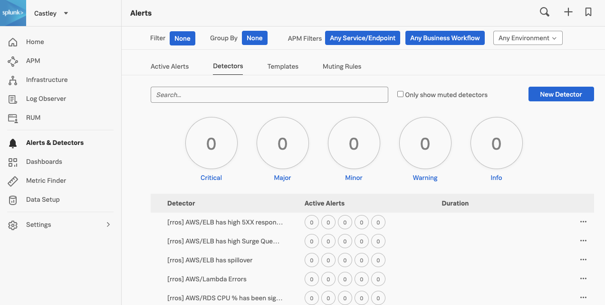
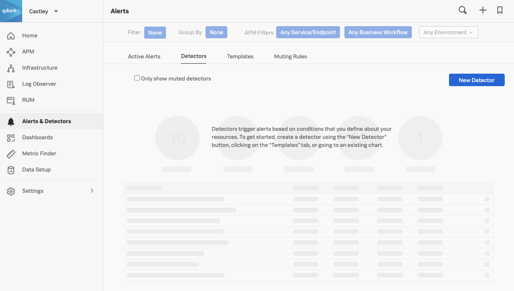

{}10 minutes{}

* Use Terraform[^1] to manage Observability Cloud Dashboards and Detectors
* Initialize the Terraform Splunk Provider[^2].
* Run Terraform to create detectors and dashboards from code using the Splunk Terraform Provider.
* See how Terraform can also delete detectors and dashboards.

---

## 1. Initial setup

Monitoring as code adopts the same approach as infrastructure as code. You can manage monitoring the same way you do applications, servers, or other infrastructure components.

You can use monitoring as code to build out your visualizations, what to monitor, and when to alert, among other things. This means your monitoring setup, processes, and rules can be versioned, shared, and reused.

Full documentation for the Splunk Terraform Provider is available [**here**](https://registry.terraform.io/providers/splunk-terraform/signalfx/latest/docs).

Remaining in your AWS/EC2 instance, change into the `o11y-cloud-jumpstart` directory

{}

``` bash
cd ~/observability-content-contrib/integration-examples/terraform-jumpstart
```

{}

Initialize Terraform and upgrade to the latest version of the Splunk Terraform Provider.

{}
You will need to run the command below each time a new version of the Splunk Terraform Provider is released. You can track the releases on [GitHub.](https://github.com/splunk-terraform/terraform-provider-signalfx/releases)
{}


{}

``` bash
terraform init -upgrade
```

{}
{}

``` text
    Upgrading modules...
    - aws in modules/aws
    - azure in modules/azure
    - docker in modules/docker
    - gcp in modules/gcp
    - host in modules/host
    - kafka in modules/kafka
    - kubernetes in modules/kubernetes
    - parent_child_dashboard in modules/dashboards/parent
    - pivotal in modules/pivotal
    - rum_and_synthetics_dashboard in modules/dashboards/rum_and_synthetics
    - usage_dashboard in modules/dashboards/usage

    Initializing the backend...

    Initializing provider plugins...
    - Finding latest version of splunk-terraform/signalfx...
    - Installing splunk-terraform/signalfx v6.20.0...
    - Installed splunk-terraform/signalfx v6.20.0 (self-signed, key ID CE97B6074989F138)

    Partner and community providers are signed by their developers.
    If you'd like to know more about provider signing, you can read about it here:
    https://www.terraform.io/docs/cli/plugins/signing.html

    Terraform has created a lock file .terraform.lock.hcl to record the provider
    selections it made above. Include this file in your version control repository
    so that Terraform can guarantee to make the same selections by default when
    you run "terraform init" in the future.

    Terraform has been successfully initialized!

    You may now begin working with Terraform. Try running "terraform plan" to see
    any changes that are required for your infrastructure. All Terraform commands
    should now work.

    If you ever set or change modules or backend configuration for Terraform,
    rerun this command to reinitialize your working directory. If you forget, other
    commands will detect it and remind you to do so if necessary.
```

{}


## 2. Create execution plan

The `terraform plan` command creates an execution plan. By default, creating a plan consists of:

* Reading the current state of any already-existing remote objects to make sure that the Terraform state is up-to-date.
* Comparing the current configuration to the prior state and noting any differences.
* Proposing a set of change actions that should, if applied, make the remote objects match the configuration.

The plan command alone will not actually carry out the proposed changes, and so you can use this command to check whether the proposed changes match what you expected before you apply the changes


{}

```bash
terraform plan -var="api_token=$API_TOKEN" -var="realm=$REALM" -var="o11y_prefix=[$INSTANCE]"
```

{}
{}

``` text
Plan: 146 to add, 0 to change, 0 to destroy.
```

{}


If the plan executes successfully, we can go ahead and apply:

---

## 3. Apply execution plan

The `terraform apply` command executes the actions proposed in the Terraform plan above.

The most straightforward way to use `terraform apply` is to run it without any arguments at all, in which case it will automatically create a new execution plan (as if you had run terraform plan) and then prompt you to provide the API Token, Realm (the prefix defaults to `Splunk`) and approve the plan, before taking the indicated actions.

Due to this being a workshop it is required that the prefix is to be unique so you need to run the `terraform apply` below.


{}

``` bash
terraform apply -var="api_token=$API_TOKEN" -var="realm=$REALM" -var="o11y_prefix=[$INSTANCE]"
```

{}
{}

``` text
Apply complete! Resources: 146 added, 0 changed, 0 destroyed.
```

{}


Once the apply has been completed, validate that the detectors were created, under the **Alerts & Detectors** and click on the **Detectors** tab. They will be prefixed by the instance name. To check the prefix value run:

``` bash
echo $INSTANCE
```

 You will see a list of the new detectors and you can search for the prefix that was output from above.



## 3. Destroy all your hard work

The `terraform destroy` command is a convenient way to destroy all remote objects managed by your Terraform configuration.

While you will typically not want to destroy long-lived objects in a production environment, Terraform is sometimes used to manage ephemeral infrastructure for development purposes, in which case you can use `terraform destroy` to conveniently clean up all of those temporary objects once you are finished with your work.

Now go and destroy all the Detectors and Dashboards that were previously applied!


{}

``` bash
terraform destroy -var="api_token=$API_TOKEN" -var="realm=$REALM"
```

{}
{}

``` text
Destroy complete! Resources: 146 destroyed.
```

{}


Validate all the detectors have been removed by navigating to _**Alerts → Detectors**_



[^1]: Terraform is a tool for building, changing, and versioning infrastructure safely and efficiently. Terraform can manage existing and popular service providers as well as custom in-house solutions.

[^2]: A provider is responsible for understanding API interactions and exposing resources. Providers generally are an IaaS (e.g. Alibaba Cloud, AWS, GCP, Microsoft Azure, OpenStack), PaaS (e.g. Heroku), or SaaS services (e.g. Splunk, Terraform Cloud, DNSimple, Cloudflare).
