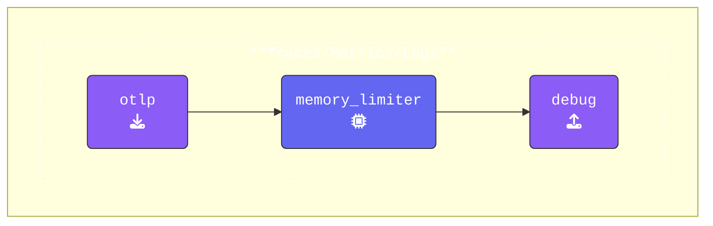

Let's walk through a few modifications to our agent configuration to get things started:

{}

- **Add an `otlp` receiver**: The [**OTLP receiver**](https://docs.splunk.com/observability/en/gdi/opentelemetry/components/otlp-receiver.html) will listen for incoming telemetry data over HTTP (or gRPC).

  ```yaml
    otlp:                           # Receiver Type
      protocols:                    # list of Protocols used 
        http:                       # This wil enable the HTTP Protocol
          endpoint: "0.0.0.0:4318"  # Endpoint for incoming telemetry data
  ```

- **Add a `debug` exporter**: The [**Debug exporter**](https://github.com/open-telemetry/opentelemetry-collector/blob/main/exporter/debugexporter/README.md) will output detailed debug information for every telemetry record.

  ```yaml  
    debug:                          # Exporter Type
      verbosity: detailed           # Enabled detailed debug output
  ```

- **Update Pipelines**: Ensure that the `otlp` receiver, `memory_limiter` processor, and `debug` exporter are added to the pipelines for `traces`, `metrics`, and `logs`. You can choose to use the format below or use array brackets `[memory_limiter]`:

  ```yaml
      traces:
        receivers:
        - otlp                      # OTLP Receiver 
        processors:
        - memory_limiter            # Memory Limiter Processor  
        exporters:
        - debug                     # Debug Exporter
  ```

{}

{}
During this workshop, we will use **[otelbin.io](https://www.otelbin.io/)** to quickly validate YAML syntax and ensure OpenTelemetry configurations are correct. This helps prevent errors before running tests during this workshop.

To validate your configuration:

1. Open **[otelbin.io](https://www.otelbin.io/)** and replace the existing configuration by pasting your own YAML into the left pane.
2. At the top of the page, ensure that **Splunk OpenTelemetry Collector** is selected as the validation target.
3. Once validated, refer to the image representation below to verify if your pipelines are correctly set up.

In most cases, we will display only the key pipeline. However, if all three pipelines (**Traces**, **Metrics**, and **Logs**) share the same structure, we will indicate this instead of displaying each one separately.

{}


