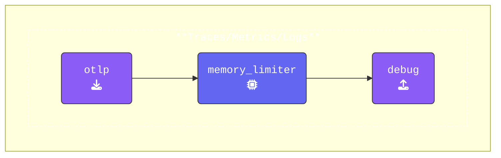

{}
Let's walk through a few modifications to get things started.

- **Add an `otlp` receiver**: The [**OTLP receiver**](https://docs.splunk.com/observability/en/gdi/opentelemetry/components/otlp-receiver.html) will listen for incoming telemetry data over HTTP (or gRPC).

  ```yaml
    otlp:                           # Receiver Type
      protocols:                    # list of Protocols used 
        http:                       # This wil enable the HTTP Protocol
          endpoint: "0.0.0.0:4318"  # Endpoint for incoming telemetry data
  ```

- **Add a `debug` exporter**: The [**Debug exporter**](https://github.com/open-telemetry/opentelemetry-collector/blob/main/exporter/debugexporter/README.md) will output detailed debug information for every telemetry record.

  ```yaml  
    debug:                          # Exporter Type
      verbosity: detailed           # Enabled detailed debug output
  ```

- **Update Pipelines**: Ensure that the `otlp` receiver, `memory_limiter` processor, and `debug` exporter are added to the pipelines for `traces`, `metrics`, and `logs`. You can choose to use the format below or use array brackets `[memory_limiter]`:

  ```yaml
      traces:
        receivers:
        - otlp                      # OTLP Receiver 
        processors:
        - memory_limiter            # Memory Limiter Processor  
        exporters:
        - debug                     # Debug Exporter
      #metrics:  
      #logs:     
  ```

{}

{}
Pay close attention to the formatting, as the OpenTelemetry Collector configuration relies on proper YAML structure.
{}

Validate the agent configuration using **[otelbin.io](https://www.otelbin.io/)**.

{}
Make sure the **Splunk OpenTelemetry Collector** distribution is selected as the validation target.
{}


