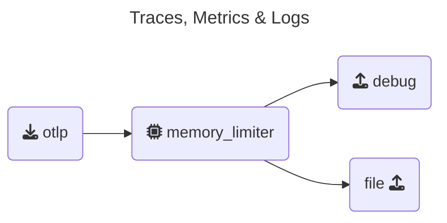

To capture more than just debug output on the screen, we also want to generate output during the export phase of the pipeline. For this, we'll add a **File Exporter** to write OTLP data to files for comparison.

The difference between the OpenTelemetry **debug exporter** and the **file exporter** lies in their purpose and output destination:

| Feature             | Debug Exporter                  | File Exporter                 |
|---------------------|---------------------------------|-------------------------------|
| **Output Location** | Console/Log                     | File on disk                  |
| **Purpose**         | Real-time debugging             | Persistent offline analysis   |
| **Best for**        | Quick inspection during testing | Temporary storage and sharing |
| **Production Use**  | No                              | Rare, but possible            |
| **Persistence**     | No                              | Yes                           |

In summary, the **debug exporter** is great for real-time, in-development troubleshooting, while the **file exporter** is better suited for storing telemetry data locally for later use.

Find your `Agent` terminal window, and stop the running collector by pressing `Ctrl-C`. Once the `agent` has stopped, open the `agent.yaml` and configure the `FileExporter`:

{}

- **Configuring a `file` exporter**: Add the following under the `exporters` section of your `agent.yaml`:

  ```yaml
    file:                           # Exporter Type
      path: "./agent.out"           # Path where data will be saved in OTLP json format
      append: false                 # Overwrite the file each time
  ```

- **Update the Pipelines Section**: Add the `file` exporter to the `metrics`, `traces` and `logs` pipelines (leave debug as the first in the array).

  ```yaml
      #traces:       
      metrics:
        receivers:
        - otlp                      # OTLP Receiver
        processors:
        - memory_limiter            # Memory Limiter Processor
        exporters:
        - debug                     # Debug Exporter
        - file                      # File Exporter
      #logs:
  ```

{}

To verify that your updated `agent.yaml` file is correct, validate it using [**otelbin.io**](https://www.otelbin.io/).

For reference, the `traces:` section of your pipelines should look similar to this:



<!--

-->

{}

If **otelbin.io** shows a warning regarding the `scraper` or`append` keys, check the validation target at the top of the page. Make sure the **Splunk OpenTelemetry Collector** is selected as the validation target.

{}
