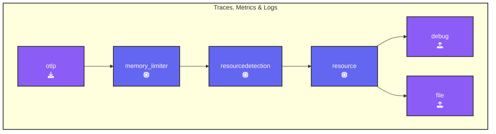

So far, we’ve essentially exported a direct copy of the `span` sent through the OpenTelemetry Collector.  
Now, let’s enhance the base `span` by adding metadata using `processors`. This additional information can be valuable for troubleshooting and for enabling features like `Related Content`.

Find your `Agent` terminal window, and stop the running collector by pressing `Ctrl-C`. Once the `agent` has stopped, open the `agent.yaml` and configure the `resourcedetection` & `resource` processors:

{}

- **Add the `resourcedetection` Processor**: The [**Resource Detection Processor**](https://github.com/open-telemetry/opentelemetry-collector-contrib/blob/main/processor/resourcedetectionprocessor/README.md) can be used to detect resource information from the host and append or override the resource value in telemetry data with this information.

  ```yaml
    resourcedetection:              # Processor Type
      detectors: [system]           # Resource detectors (system & cloud providers etc.)
      override: true                # Overwrites existing attributes in the data

- **Add `resource` Processor ** and name it `add_mode`**: The Resource Processor can be used to apply changes on resource attributes.

  ```yaml
    resource/add_mode:              # Processor Type/Name
      attributes:                   # Array of attributes and modifications
      - action: insert              # Action is to insert a key
        key: otelcol.service.mode   # Key name
        value: "agent"              # Key value
  ```

- **Update All Pipelines**: Add both processors (`resourcedetection` and `resource/add_mode`) to the `processors` array in **all pipelines** (traces, metrics, and logs). Ensure `memory_limiter` remains the first processor.

    ```yaml
      #traces:
      metrics:
        receivers:
        - otlp                        # OTLP Receiver
        processors:
        - memory_limiter              # Memory Limiter Processor
        - resourcedetection           # Adds system attributes to the data
        - resource/add_mode           # Adds collector mode metadata
        exporters:
        - debug                       # Debug Exporter
        - file                        # File Exporter
      #logs:
  ```

{}

By adding these processors, we enrich the data with system metadata and the agent’s operational mode, which aids in troubleshooting and provides useful context for related content.

Validate your updated `agent.yaml` with [**otelbin.io**](https://www.otelbin.io/):


<!--

-->
