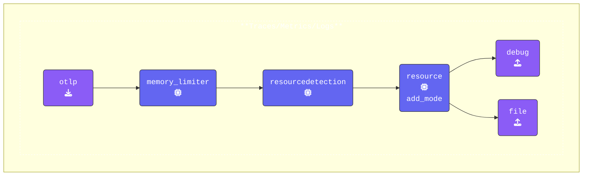

So far, we've simply exported an exact copy of the span sent through the OpenTelemetry Collector.

Now, let's improve the base span by adding metadata with processors. This extra information can be helpful for troubleshooting.

Find your **Agent** terminal window, and stop the running collector by pressing `Ctrl-C`. Once the **Agent** has stopped, open the `agent.yaml` and configure the `resourcedetection` and `resource` processors:

{}

- **Add the `resourcedetection` Processor**: The [**Resource Detection Processor**](https://github.com/open-telemetry/opentelemetry-collector-contrib/blob/main/processor/resourcedetectionprocessor/README.md) can be used to detect resource information from the host and append or override the resource value in telemetry data with this information.

  ```yaml
    resourcedetection:              # Processor Type
      detectors: [system]           # Detect system resource information
      override: true                # Overwrites existing attributes

- **Add `resource` Processor and name it `add_mode`**: The [**Resource Processor**](https://github.com/open-telemetry/opentelemetry-collector-contrib/blob/main/processor/resourceprocessor/README.md) can be used to apply changes on resource attributes.

  ```yaml
    resource/add_mode:              # Processor Type/Name
      attributes:                   # Array of attributes and modifications
      - action: insert              # Action is to insert a key
        key: otelcol.service.mode   # Key name
        value: "agent"              # Key value
  ```

- **Update All Pipelines**: Add both processors (`resourcedetection` and `resource/add_mode`) to the `processors` array in **all pipelines** (traces, metrics, and logs). Ensure `memory_limiter` remains the first processor.

    ```yaml
        metrics:
          receivers:
          - otlp                      # OTLP Receiver
          processors:
          - memory_limiter            # Memory Limiter Processor
          - resourcedetection         # Adds system attributes to the data
          - resource/add_mode         # Adds collector mode metadata
          exporters:
          - debug                     # Debug Exporter
          - file                      # File Exporter
    ```

{}

By adding these processors, we enrich the data with system metadata and the agent’s operational mode, which aids in troubleshooting and provides useful context for related content.

Validate the agent configuration using **[otelbin.io](https://www.otelbin.io/)**:


