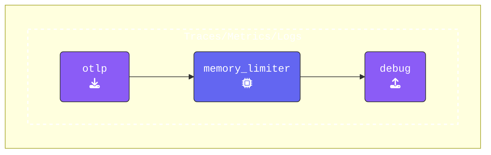

### Setup

In your `[WORKSHOP]` directory, create a subdirectory called `1-agent`, then move into that directory.

```text
mkdir -p [WORKSHOP]/1-agent
cd [WORKSHOP]/1-agent
```

Inside the `1-agent` directory, create a file named `agent.yaml`. This file will define the basic structure of an OpenTelemetry Collector configuration, including the necessary components.

Copy and paste the following initial configuration into `agent.yaml`:

```yaml
###########################        This section holds all the
## Configuration section ##        configurations that can be 
###########################        used in this OpenTelemetry Collector
extensions:                       # Array of Extensions
  health_check:                   # Configures the health check extension
    endpoint: 0.0.0.0:13133       # Endpoint to collect health check data

receivers:                        # Array of Receivers
  hostmetrics:                    # Receiver Type
    collection_interval: 3600s    # Scrape metrics every hour
    scrapers:                     # Array of hostmetric scrapers
      cpu:                        # Scraper for cpu metrics

exporters:                        # Array of Exporters

processors:                       # Array of Processors
  memory_limiter:                 # Limits memory usage by Collectors pipeline
    check_interval: 2s            # Interval to check memory usage
    limit_mib: 512                # Memory limit in MiB

###########################         This section controls what
### Activation Section  ###         configurations will be used  
###########################         by this OpenTelemetry Collector
service:                          # Services configured for this Collector
  extensions: [health_check]      # Enabled extensions for this collector   
  pipelines:                      # Array of configured pipelines  
    traces:
      receivers:
      processors:
      - memory_limiter            # Memory Limiter processor                
      exporters:
    metrics:
      receivers:
      processors:
      - memory_limiter            # Memory Limiter processor
      exporters:
    logs:
      receivers:
      processors:
      - memory_limiter            # Memory Limiter processor
      exporters:

```

{}

```text
[WORKSHOP]
├── 1-agent         # Module directory
│   └── agent.yaml  # OpenTelemetry Collector configuration file
└── otelcol         # OpenTelemetry Collector binary
```

{}

{}
Let's walk through a few modifications to get things started.

- **Add an `otlp` receiver**: The [**OTLP receiver**](https://docs.splunk.com/observability/en/gdi/opentelemetry/components/otlp-receiver.html) will listen for incoming telemetry data over HTTP (or gRPC).

  ```yaml
    otlp:                           # Receiver Type
      protocols:                    # list of Protocols used 
        http:                       # This wil enable the HTTP Protocol
          endpoint: "0.0.0.0:4318"  # Endpoint for incoming telemetry data
  ```

- **Add a `debug` exporter**: The [**Debug exporter**](https://github.com/open-telemetry/opentelemetry-collector/blob/main/exporter/debugexporter/README.md) will output detailed debug information for every telemetry record.

  ```yaml  
    debug:                          # Exporter Type
      verbosity: detailed           # Enabled detailed debug output
  ```

- **Update Pipelines**: Ensure that the `otlp` receiver, `memory_limiter` processor, and `debug` exporter are added to the pipelines for `traces`, `metrics`, and `logs`. You can choose to use the format below or use array brackets   [memory_limiter]

  ```yaml
      traces:
        receivers:
        - otlp                      # OTLP Receiver 
        processors:
        - memory_limiter            # Memory Limiter Processor  
        exporters:
        - debug                     # Debug Exporter
      #metrics:  
      #logs:     
  ```

{}

{}
Pay close attention to the formatting, as the OpenTelemetry Collector configuration relies on proper YAML structure.
{}

Use [**otelbin.io**](https://otelbin.io) to validate your `agent.yaml` file, you can quickly identify spelling, YAML formatting and configuration errors. If everything is set up correctly, your configuration for the all pipelines should look like this:



You can safely ignore the warning about the unused `hostmetrics` receiver, we will use it later.
<!--


-->
