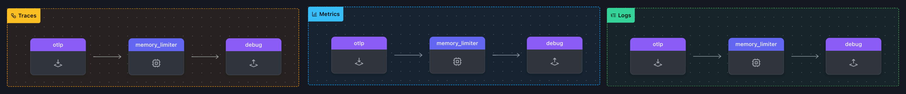

### Setup

In your `[WORKSHOP]` directory, create a sub directory called `1-agent` and change into it.

In `[WORKSHOP]/1-agent` create a file called `agent.yaml` and copy the following starting config in to it:

```yaml
receivers:

exporters:
    
processors:
  memory_limiter:
    check_interval: 2s
    limit_mib: 512
  
service:
  pipelines:
    traces:
      receivers: []
      processors:
      -
      exporters: []
    metrics:
      receivers: []
      processors: 
       -
      exporters: []
    logs: 
      receivers: []
      processors: 
      - 
      exporters: []
```

Let's start with our first exercise:

{}

- Add `otlp:` under the `receivers:` key (taking care to format it correctly)
  - Add `otlp:` key
    - Add `http:` key
      - Add `endpoint:` key wand set a value of `"0.0.0.0:4318"`

{{% expand title="{}**Hint**{}" %}}

```yaml
  otlp:
    protocols:
      http:
        endpoint: "0.0.0.0:4318"
```

{}

- Add a `debug` exporter under the `exporters:` key
  - Add `verbosity:`key and set it a value of `detailed`
- Add the `otlp` receiver to the `traces:`, `metrics:` and `logs:` pipelines
- Add the `memory_limiter` processor to the `traces:`, `metrics:` and `logs:` pipelines
- Add the `debug` exporter to the `traces:`, `metrics:` and `logs:` pipelines
{{% expand title="{}**Hint**{}" %}}

```yaml
 # here is an example of the tracing  pipeline.....

  pipelines:
    traces:
      receivers: [otlp]
      processors:   # you also could use [memory_limiter]
      - memory_limiter
      exporter: [debug]

    # metrics: pipeline section...  
```

{}

{}

{}
 Note that in the exercise above we give you all key elements in yaml format, you just need to correct them yourself.
 Pay attention to the format as the configuration of the agent is yaml based.

 We will have only a limited sets hints going forward

 If you are unsure about the format you can look at **[otelbin.io](https://www.otelbin.io/)** as that wil show a default agent config when first visited

{}

By using **[otelbin.io](https://www.otelbin.io/)** to validate your agent.yaml, you can catch spelling and or configuration errors.  
If done correctly your configuration should look like this:



---

### Test & Validate

Run the following command to  test your config (make sure you use the right otel collector you downloaded):

```text
[WORKSHOP]/otelcol --config=agent.yaml
```

If you have done everything correctly, the last line of the output should be :

```text
2025-01-13T12:43:51.747+0100 info service@v0.116.0/service.go:261 Everything is ready. Begin running and processing data.
```

Now start a new shell and create a file called `trace.json` and copy the following content (Pick one of the tabs, both tabs contain the same trace data):

{}
{}

```json
{"resourceSpans":[{"resource":{"attributes":[{"key":"service.name","value":{"stringValue":"my.service"}},{"key":"deployment.environment","value":{"stringValue":"my.environment"}}]},"scopeSpans":[{"scope":{"name":"my.library","version":"1.0.0","attributes":[{"key":"my.scope.attribute","value":{"stringValue":"some scope attribute"}}]},"spans":[{"traceId":"5B8EFFF798038103D269B633813FC60C","spanId":"EEE19B7EC3C1B174","parentSpanId":"EEE19B7EC3C1B173","name":"I'm a server span","startTimeUnixNano":"1544712660000000000","endTimeUnixNano":"1544712661000000000","kind":2,"attributes":[{"keytest":"my.span.attr","value":{"stringValue":"some value"}}]}]}]}]}
```

{}
{}

```json
{
    "resourceSpans": [
      {
        "resource": {
          "attributes": [
            {
              "key": "service.name",
              "value": {
                "stringValue": "my.service"
              }
            },
            {
              "key": "deployment.environment",
              "value": {
                "stringValue": "my.environment"
              }
            }
          ]
        },
        "scopeSpans": [
          {
            "scope": {
              "name": "my.library",
              "version": "1.0.0",
              "attributes": [
                {
                  "key": "my.scope.attribute",
                  "value": {
                    "stringValue": "some scope attribute"
                  }
                }
              ]
            },
            "spans": [
              {
                "traceId": "5B8EFFF798038103D269B633813FC60C",
                "spanId": "EEE19B7EC3C1B174",
                "parentSpanId": "EEE19B7EC3C1B173",
                "name": "I'm a server span",
                "startTimeUnixNano": "1544712660000000000",
                "endTimeUnixNano": "1544712661000000000",
                "kind": 2,
                "attributes": [
                  {
                    "keytest": "my.span.attr",
                    "value": {
                      "stringValue": "some value"
                    }
                  }
                ]
              }
            ]
          }
        ]
      }
    ]
  }
```

{}
{}

In the second shell, run the following command to test your setup and validate the output:

{}
{}

```sh
curl -X POST -i http://localhost:4318/v1/traces \
-H "Content-Type: application/json" \
-d @trace.json 
```

{}
{}

 ```text
 2025-01-13T13:26:13.502+0100 info Traces {"kind": "exporter", "data_type": "traces", "name": "debug", "resource spans": 1, "spans": 1}
2025-01-13T13:26:13.502+0100 info ResourceSpans #0
Resource SchemaURL:
Resource attributes:
     -> service.name: Str(my.service)
     -> deployment.environment: Str(my.environment)
ScopeSpans #0
ScopeSpans SchemaURL:
InstrumentationScope my.library 1.0.0
InstrumentationScope attributes:
     -> my.scope.attribute: Str(some scope attribute)
Span #0
    Trace ID       : 5b8efff798038103d269b633813fc60c
    Parent ID      : eee19b7ec3c1b173
    ID             : eee19b7ec3c1b174
    Name           : I'm a server span
    Kind           : Server
    Start time     : 2018-12-13 14:51:00 +0000 UTC
    End time       : 2018-12-13 14:51:01 +0000 UTC
    Status code    : Unset
    Status message :
Attributes:
     -> : Str(some value)
  {"kind": "exporter", "data_type": "traces", "name": "debug"}
```

{}
{}

Next, we will configure a **file** exporter and use that to simluate data collection.
