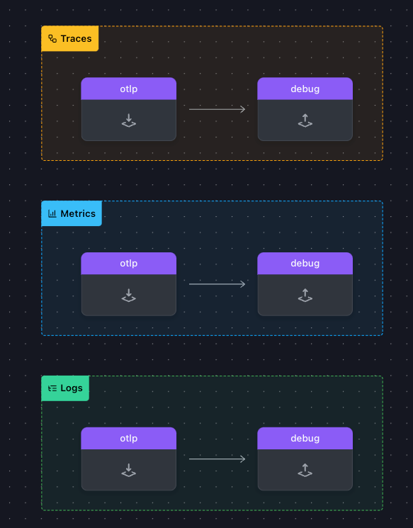

Pick a location where you are going to run the workshop on your machine, (we will use [WORKSHOP] for this location), create a sub directory called **1-agent** and  move into it.

In *[WORKSHOP]/1-agent* create  a file called **agent.yaml**  and copy the following starting config in it.

``` text
receivers:

exporters:
    
processors:
  memory_limiter:
    check_interval: 2s
    limit_mib: 512
  
service:
  pipelines:
    traces:
    metrics:
    logs:
```

Let's start with our first exercise:

{}

* Add an **otlp:** receiver, under the *protocols:* section, add a *HTTP:* entry, with an endpoint of *"0.0.0.0:4318"* and add it as a receiver to all the 8*receiver:* sections of the pipelines  
* Enable the **memory_limiter:** processor by adding it in the *processor:* section of all the pipelines
* Add a **debug:* exporter with *verbosity:* entry set to *detailed* and also add it as an exporter in all *exporter:* sections of the pipelines

{}

{}
 Note that in the exercise  above all key elements are highlighted, you just need to add them yourself.
 Pay attention to the format as the configuration of the agent is using yaml based.

{}

if you use [https://www.otelbin.io/](https://www.otelbin.io/) to validate your agent.yaml your configuration should look like this:



---
Run the following command to  test your config (make sure you use the right otel collector you downloaded):

```text
[LOCATION_OF_OTELCOLLECTOR]/otelcol_darwin_arm64 --config=agent.yaml
```

If you have done everything correctly, the last line of the output should be :

```text
2025-01-13T12:43:51.747+0100 info service@v0.116.0/service.go:261	Everything is ready. Begin running and processing data.
```

Now  start a new shell and create a file called **trace.json* and copy the following content:

```text
{
    "resourceSpans": [
      {
        "resource": {
          "attributes": [
            {
              "key": "service.name",
              "value": {
                "stringValue": "my.service"
              }
            },
            {
              "key": "deployment.environment",
              "value": {
                "stringValue": "my.environment"
              }
            }
          ]
        },
        "scopeSpans": [
          {
            "scope": {
              "name": "my.library",
              "version": "1.0.0",
              "attributes": [
                {
                  "key": "my.scope.attribute",
                  "value": {
                    "stringValue": "some scope attribute"
                  }
                }
              ]
            },
            "spans": [
              {
                "traceId": "5B8EFFF798038103D269B633813FC60C",
                "spanId": "EEE19B7EC3C1B174",
                "parentSpanId": "EEE19B7EC3C1B173",
                "name": "I'm a server span",
                "startTimeUnixNano": "1544712660000000000",
                "endTimeUnixNano": "1544712661000000000",
                "kind": 2,
                "attributes": [
                  {
                    "keytest": "my.span.attr",
                    "value": {
                      "stringValue": "some value"
                    }
                  }
                ]
              }
            ]
          }
        ]
      }
    ]
  }

```

In the second Shell, run the following command to test your setup:

```text
curl -X POST -i http://localhost:4318/v1/traces \
-H "Content-Type: application/json" \
 -d @trace.json 
```

Your collector should show the following output:

 ```text
 2025-01-13T13:26:13.502+0100	info	Traces	{"kind": "exporter", "data_type": "traces", "name": "debug", "resource spans": 1, "spans": 1}
2025-01-13T13:26:13.502+0100	info	ResourceSpans #0
Resource SchemaURL:
Resource attributes:
     -> service.name: Str(my.service)
     -> deployment.environment: Str(my.environment)
ScopeSpans #0
ScopeSpans SchemaURL:
InstrumentationScope my.library 1.0.0
InstrumentationScope attributes:
     -> my.scope.attribute: Str(some scope attribute)
Span #0
    Trace ID       : 5b8efff798038103d269b633813fc60c
    Parent ID      : eee19b7ec3c1b173
    ID             : eee19b7ec3c1b174
    Name           : I'm a server span
    Kind           : Server
    Start time     : 2018-12-13 14:51:00 +0000 UTC
    End time       : 2018-12-13 14:51:01 +0000 UTC
    Status code    : Unset
    Status message :
Attributes:
     -> : Str(some value)
	{"kind": "exporter", "data_type": "traces", "name": "debug"}
```

Let's move on to adding a file exporter to use that to mimic  a backend
