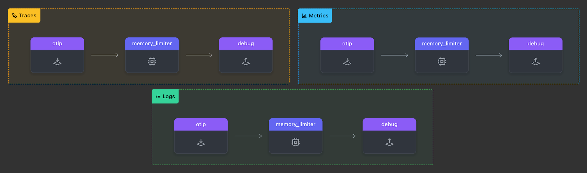

### Setup

In your `[WORKSHOP]` directory, create a subdirectory named `1-agent` and navigate into it:

```text
mkdir -p [WORKSHOP]/1-agent
cd [WORKSHOP]/1-agent
```

Inside the `1-agent` directory, we will create a file containing the basic structure of an OpenTelemetry Collector configuration, defining the components you'll need to work with.

To do this, create a file called `agent.yaml` and paste the following starting configuration into it:

```yaml
###########################  This section holds all the
## Configuration section ##  configurations that can be 
###########################  used in this OpenTelemetry Collector
extensions:
  health_check:              # Configures the health check extension
    endpoint: 0.0.0.0:13133

receivers:

exporters:
    
processors:
  memory_limiter:            # Limits memory usage of the OpenTelemetry Collector
    check_interval: 2s       # Interval to check memory usage
    limit_mib: 512           # Memory limit in MiB

###########################  This section controls what
### Activation Section  ###  configurations will be used  
###########################  by this OpenTelemetry Collector
service:
  extensions: [health_check] # Enabled extensions for this collector   
  pipelines:
    traces:
      receivers: []
      processors:            # Alternative syntax option [memory_limiter]
      - memory_limiter
      exporters: []
    metrics:
      receivers: []
      processors:
      - memory_limiter
      exporters: []
    logs: 
      receivers: []
      processors:
      - memory_limiter
      exporters: []
```

{}

```text
[WORKSHOP]
├── 1-agent         # Module directory
│   └── agent.yaml  # OpenTelemetry Collector configuration file
└── otelcol         # OpenTelemetry Collector binary
```

{}

{}
Let's walk through a few modifications to get things started.

- **Add an `otlp` receiver**: The [**OTLP receiver**](https://docs.splunk.com/observability/en/gdi/opentelemetry/components/otlp-receiver.html) will listen for incoming telemetry data over HTTP (or gRPC).

  ```yaml
    otlp:
      protocols:                    # list of Protocols used 
        http:                       # This wil enable the HTTP Protocol
          endpoint: "0.0.0.0:4318"  # Endpoint for incoming telemetry data
  ```

- **Add a `debug` exporter**: The [**Debug exporter**](https://github.com/open-telemetry/opentelemetry-collector/blob/main/exporter/debugexporter/README.md) will output detailed debug information for every telemetry record.

  ```yaml
    
    debug:                         # Exporter Type
      verbosity: detailed          # Enabled detailed debug output
  ```

- **Update Pipelines**: Ensure that the `otlp` receiver, `memory_limiter` processor, and `debug` exporter are added to the pipelines for traces, metrics, and logs.

  ```yaml
      traces:               # Traces Pipeline
        receivers: [otlp]   # Array of receivers in this pipeline
        processors:         # Array of Processors in thi pipeline
        - memory_limiter    # You also could use [memory_limiter]
        exporters: [debug]  # Array of Exporters in this pipeline
     #metrics:               # Metrics Pipeline
     #logs:                  # Logs Pipeline
  ```

{}

{}
In the exercise above, we’ve provided all the key elements in YAML format, but it’s up to you to correct and complete them. Be mindful of the formatting, as the OpenTelemetry Collector configuration is YAML-based.

Going forward, we will build upon these changes and apply what you've learned.
{}

By using [**otelbin.io**](https://otelbin.io) to validate your `agent.yaml` file, you can quickly identify spelling or configuration errors. If everything is set up correctly, your configuration for all pipelines should look like this (click the image to enlarge):

<!---->


Let's test our config!
