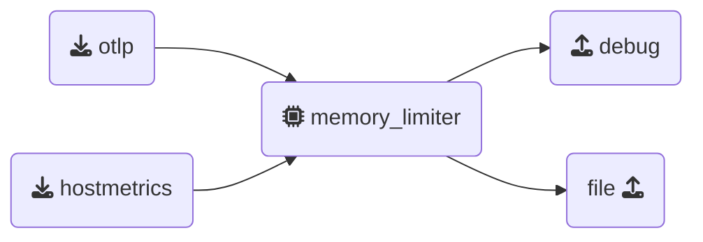

## Test Gateway

Open a 3rd terminal window, this one will be used to run the `gateway` and navigate to the`[WORKSHOP]/2-gateway` directory and run the following command to test the gateway configuration:

```text
../otelcol --config=gateway.yaml
```

If everything is set up correctly, the first and last lines of the output should look like:

```text
2025/01/15 15:33:53 settings.go:478: Set config to [gateway.yaml]
<snip to the end>
2025-01-13T12:43:51.747+0100 info service@v0.116.0/service.go:261 Everything is ready. Begin running and processing data.
```

---

### Update agent configuration

Select your `agent` terminal window, and also navigate to the `[WORKSHOP]/2-gateway` directory.  
Open the `agent.yaml` we copied earlier in your editor, and configure a `otlphttp` exporter by replacing the existing `file` exporter. (this is now the preferred exporter for Splunk Observability Cloud):

{}

- **Configure the `otlphttp` exporter**: Ensure the `endpoint` is set to the gateway endpoint and add the `X-SF-Token` header with a Splunk Access Token.

  ```yaml
    otlphttp:
      endpoint: "http://localhost:5318" # Gateway endpoint
      headers:
        # Replace with a Splunk Access Token
        X-SF-Token: "FAKE_SPLUNK_ACCESS_TOKEN"
  ```

- **Add a batch processor to the agent**: since the agent can send data from different sources, and benefit from retries, adding a Batch processor is useful too:

  ```yaml
    batch:                     # Processor Type
    # Array of metadata keys to batch data by
      metadata_keys: [X-SF-Token] 
  ```

- **Update Pipelines**: replace the `file:` exporter with the `otlphttp` exporter in the `traces`, `metrics`, and `logs` pipelines. Also, add the `hostmetrics` receiver to the `metrics` pipeline.

  ```yaml
     #traces:            # Traces Pipeline
     metrics:            # Metrics Pipeline
      receivers: [otlp, hostmetrics]  # Array of receivers in this pipeline
      processors:        # Array of Processors in thi pipeline
      - memory_limiter   # You also could use [memory_limiter]
      - resourcedetection
      - resource/add_mode
      - batch
      # Array of Exporters in this pipeline
      exporters: [otlphttp, debug]
      # logs:            # Log's Pipeline
  ```

{}  
Again, validate the agent configuration using **[otelbin.io](https://www.otelbin.io/)**. As example, here is the result for the `metrics` pipeline:




{}
The `otlphttp` exporter is now the default method for sending metrics and traces to the Splunk Observability Cloud.  

This exporter is included in the default configuration of the Splunk Distribution of the OpenTelemetry Collector when deployed in host monitoring (agent) mode.  

The use of older `sapm` and `signalfx` exporters are being phased out gradually.  

#### Additional info on how to use Splunk Access Tokens

- **Headers Configuration**:
  Use the `headers:` key with the sub-key `X-SF-Token:` to pass an access token. This aligns with the OpenTelemetry approach for token-based authentication.  
  This works both in `agent` as in `gateway` mode.

- **Pass-through Mode**:
  To enable pass-through mode, set `include_metadata:` to `true` in the `otlp` receiver configuration on the gateway. This ensures that headers received by the collector are forwarded with the data through the collector's pipeline.

- **Batch Processing**:
  Configure the `batch:` section with the key `X-SF-Token:` to group traces, metrics, and logs by the same access token. This helps the collector batch data efficiently before sending it to the backend, improving performance and reducing overhead. This works both in `agent` as in `gateway` mode.

{}
