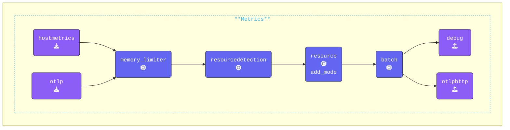

### Test Gateway

{}

- **Start your Gateway**
  1. Start of find your third (**Gateway**) terminal window.
  2. Navigate to the`[WORKSHOP]/2-gateway` directory.
  3. Run the following command to test the gateway configuration:

  ```text
  ../otelcol --config=gateway.yaml
  ```

  If everything is set up correctly, the first and last lines of the output should look like:

  ```text
  2025/01/15 15:33:53 settings.go:478: Set config to [gateway.yaml]
  <snip to the end>
  2025-01-13T12:43:51.747+0100 info service@v0.116.0/service.go:261 Everything is ready. Begin running and processing data.
  ```

{}

---

### Update Agent Configuration

{}

- **Update Agent.yaml**  
  1. Switch to your **Agent** terminal window.
  2. Make sure you are in the `[WORKSHOP]/2-gateway` directory.
  3. Open the `agent.yaml` file that you copied earlier in your editor.

- **Replace the existing `file` exporter**
  1. Use [**OTLPHTTP Exporter**](https://docs.splunk.com/observability/en/gdi/opentelemetry/components/otlphttp-exporter.html) as the replacement.
  The `otelhttp` exporter is used to send data from the agent to the gateway using the OTLP/HTTP protocol. This is now the preferred method for exporting data to Splunk Observability Cloud. *(More details in Section 3.3 Addendum.)*
  2. Ensure the `endpoint` is set to the gateway endpoint and port number
  3. Add the `X-SF-Token` header with a random value.  
  During this workshop, you can use **any** value for `X-SF-TOKEN`. However, if you are connecting to Splunk Observability Cloud, this is where you will need to enter your Splunk Access Token *(More details in Section 2.3 Addendum.)*

   ```yaml
      otlphttp:                       # Exporter Type
        endpoint: "http://localhost:5318" # Gateway OTLP endpoint 
        headers:                      # Headers to add to the HTTP call 
          X-SF-Token: "ACCESS_TOKEN"  # New way to set an Splunk ACCESS_TOKEN Header
    ```

- **Add a Batch Processor configuration**
  1. Use the [**Batch Processor**](https://github.com/open-telemetry/opentelemetry-collector/blob/main/processor/batchprocessor/README.md). It will accept spans, metrics, or logs and places them into batches. Batching helps better compress the data and reduce the number of outgoing connections required to transmit the data. It is highly recommended configuring the batch processor on every collector.

  ```yaml
    batch:                          # Processor Type
      metadata_keys: [X-SF-Token]   # Array of metadata keys to batch 
  ```

- **Enable the `hostmetric` receiver**
  1. Use the [**HostMetrics Reciver**](https://github.com/open-telemetry/opentelemetry-collector-contrib/tree/main/receiver/hostmetricsreceiver#readme).  
  It will generate metrics about the host system scraped from various sources.  
  2. As it is already pre-configured in the original agent.yaml, we just need to add it to the `metrics` pipeline so that you can capture and see system metrics as shown in the next YAML code.

- **Add the Batch processor to the pipeline**
  1. The batch processor should be defined in the pipeline after the `memory_limiter`, as well after any data sampling/updating processors as shown in the next YAML code.

- **Replace the `file:` exporter**:
  1. Use the `otlphttp` exporter in the `traces`, `metrics`, and `logs` pipelines instead.

  ```yaml
      metrics:    
        receivers: 
        - otlp                        # OTLP Receiver
        - hostmetrics                 # Hostmetrics Receiver
        processors:
        - memory_limiter              # Memory Limiter Processor
        - resourcedetection           # Adds system attributes to the data
        - resource/add_mode           # Adds collector mode metadata
        - batch                       # Batch Processor, groups data before send
        exporters:
        - debug                       # Debug Exporter 
        - otlphttp                    # OTLP/HTTP EXporter used by Splunk O11Y
  ```

{}

Validate the agent configuration using **[otelbin.io](https://www.otelbin.io/)**. For reference, the `metrics:` section of your pipelines will look similar to this:


