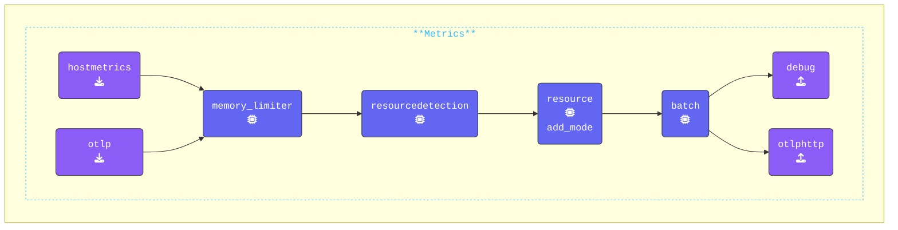

### Test Gateway

Open a third terminal window, this one will be used to run the **Gateway** and navigate to the`[WORKSHOP]/2-gateway` directory and run the following command to test the gateway configuration:

```text
../otelcol --config=gateway.yaml
```

If everything is set up correctly, the first and last lines of the output should look like:

```text
2025/01/15 15:33:53 settings.go:478: Set config to [gateway.yaml]
<snip to the end>
2025-01-13T12:43:51.747+0100 info service@v0.116.0/service.go:261 Everything is ready. Begin running and processing data.
```

---

### Update Agent Configuration

Switch to your 'agent' terminal window and navigate to the `[WORKSHOP]/2-gateway` directory.
Open the `agent.yaml` file that you copied earlier in your editor. Replace the existing `file` exporter with an `otlphttp` exporter, as this is now the preferred exporter for Splunk Observability Cloud.

Next, enable the `hostmetric` receiver in the `metrics` pipeline so that you can capture and view system metrics.

{}

- **Configure the `otlphttp` exporter**: Ensure the `endpoint` is set to the gateway endpoint and add the `X-SF-Token` header with a Splunk Access Token.

  ```yaml
    otlphttp:                       # Exporter Type
      endpoint: "http://localhost:5318" # Gateway endpoint
      headers:                      # Headers to add to the HTTP call 
        X-SF-Token: "ACCESS_TOKEN"  # New way to set an Splunk ACCESS_TOKEN Header
  ```

- **Add a batch processor to the agent**: since the agent can send data from different sources, and benefit from retries, adding a Batch processor is useful too:

  ```yaml
    batch:                          # Processor Type
      metadata_keys: [X-SF-Token]   # Array of metadata keys to batch 
  ```

- **Update Pipelines**: **replace** the `file:` exporter with the `otlphttp` exporter in the `traces`, `metrics`, and `logs` pipelines. Also, **add** the `hostmetrics` receiver to the `metrics` pipeline.

  ```yaml
      metrics:    
        receivers: 
        - otlp                        # OTLP Receiver
        - hostmetrics                 # Hostmetrics Receiver
        processors:
        - memory_limiter              # Memory Limiter Processor
        - resourcedetection           # Adds system attributes to the data
        - resource/add_mode           # Adds collector mode metadata
        - batch                       # Batch Processor, groups data before send
        exporters:
        - debug                       # Debug Exporter 
        - otlphttp                    # OTLP/HTTP EXporter used by Splunk O11Y
  ```

{}

Validate the agent configuration using **[otelbin.io](https://www.otelbin.io/)**. For reference, the `metrics:` section of your pipelines will look similar to this:


