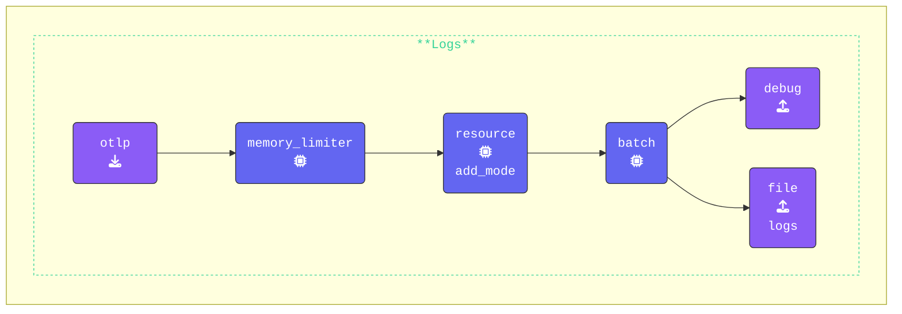

{}

In this section, we will extend the `gateway.yaml` configuration you just created to separate metric, traces & logs into different files.

**Create a `file` exporter and name it `traces`**: Separate exporters need to be configured for traces, metrics, and logs. Below is the YAML configuration for traces:

```yaml
  file/traces:                    # Exporter Type/Name
    path: "./gateway-traces.out"  # Path where data will be saved in OTLP json format
    append: false                 # Overwrite the file each time
```

**Create additional exporters for `metrics` and `logs`**: Follow the example above, and set appropriate exporter names. Update the file paths to `./gateway-metrics.out` for `metrics` and `./gateway-logs.out` for `logs`.

**Add exporters to each pipeline**: Ensure that each pipeline includes its corresponding `file` exporter, placing it after the `debug` exporter.

```yaml
    logs:
      receivers:
      - otlp                      # OTLP Receiver
      processors:
      - memory_limiter            # Memory Limiter processor
      - resource/add_mode         # Adds collector mode metadata
      - batch                     # Groups Data before send
      exporters:
      - debug                     # Debug Exporter
      - file/logs                 # File Exporter for logs
```

{}

Validate the agent configuration using **[otelbin.io](https://www.otelbin.io/)**. For reference, the `logs:` section of your pipelines will look similar to this:



{}

**Start the Gateway**:

1. Find your **Gateway** terminal window.
2. Navigate to the`[WORKSHOP]/2-gateway` directory.
3. Run the following command to test the gateway configuration:

```text
../otelcol --config=gateway.yaml
```

If everything is set up correctly, the first and last lines of the output should look like:

```text
2025/01/15 15:33:53 settings.go:478: Set config to [gateway.yaml]
<snip to the end>
2025-01-13T12:43:51.747+0100 info service@v0.116.0/service.go:261 Everything is ready. Begin running and processing data.
```

{}

Next, we will configure the **Agent** to send data to the newly created **Gateway**.
