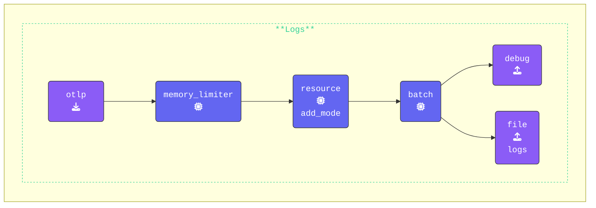

{}

- Inside the `[WORKSHOP]` directory, create a new subdirectory named `2-gateway`.
- Next, copy all contents from the `1-agent` directory into `2-gateway`.
- After copying, remove `agent.out`.
- Create a file called `gateway.yaml` and add the following initial configuration:

{}
{}

```yaml
###########################         This section holds all the
## Configuration section ##         configurations that can be 
###########################         used in this OpenTelemetry Collector
extensions:                       # Array of Extensions
  health_check:                   # Configures the health check extension
    endpoint: 0.0.0.0:14133       # Port changed to prevent conflict with agent!!!

receivers:
  otlp:                           # Receiver Type
    protocols:                    # list of Protocols used
      http:                       # This wil enable the HTTP Protocol
        endpoint: "0.0.0.0:5318"  # Port changed to prevent conflict with agent!!!
        include_metadata: true    # Needed for token pass through mode

exporters:                        # Array of Exporters
  debug:                          # Exporter Type
    verbosity: detailed           # Enabled detailed debug output

processors:                       # Array of Processors
  memory_limiter:                 # Limits memory usage by Collectors pipeline
    check_interval: 2s            # Interval to check memory usage
    limit_mib: 512                # Memory limit in MiB
  batch:                          # Processor to Batch data before sending
    metadata_keys:                # Include token in batches
    - X-SF-Token                  # Batch data grouped by Token
  resource/add_mode:              # Processor Type/Name
    attributes:                   # Array of Attributes and modifications
    - action: upsert              # Action taken is to `insert' or 'update' a key
      key: otelcol.service.mode   # key Name
      value: "gateway"            # Key Value

###########################         This section controls what
### Activation Section  ###         configuration  will be used
###########################         by the OpenTelemetry Collector
service:                          # Services configured for this Collector
  extensions: [health_check]      # Enabled extensions for this collector
  pipelines:                      # Array of configured pipelines
    traces:
      receivers:
      - otlp                      # OTLP Receiver
      processors:
      - memory_limiter            # Memory Limiter processor
      - resource/add-mode
      - batch
      exporters:
      - debug                     # Debug Exporter
    metrics:
      receivers:
      - otlp                      # OTLP Receiver
      processors:
      - memory_limiter            # Memory Limiter processor
      - resource/add-mode
      - batch
      exporters:
      - debug                     # Debug Exporter
    logs:
      receivers:
      - otlp                      # OTLP Receiver
      processors:
      - memory_limiter            # Memory Limiter processor
      - resource/add-mode
      - batch
      exporters:
      - debug                     # Debug Exporter
```

{}
{}

{}

{}

```text
[WORKSHOP]
├── 1-agent             # Module directory
├── 2-gateway           # Module directory
│   └── agent.yaml      # OpenTelemetry Collector configuration file
│   └── gateway.yaml    # OpenTelemetry Collector configuration file
│   └── trace.json      # Sample trace data
└── otelcol             # OpenTelemetry Collector binary
```

{}

{}

In this section, we will extend the `gateway.yaml` configuration you just created to separate metric, traces & logs into different files.

- **Create a `file` exporter and name it `traces`**: Separate exporters need to be configured for traces, metrics, and logs. Below is the YAML configuration for traces:

  ```yaml
    file/traces:                    # Exporter Type/Name
      path: "./gateway-traces.out"  # Path where data will be saved in OTLP json format
      append: false                 # Overwrite the file each time
  ```

- **Create additional exporters for `metrics` and `logs`**: Follow the example above, and set appropriate exporter names. Update the file paths to `./gateway-metrics.out` for `metrics` and `./gateway-logs.out` for `logs`.
- **Add exporters to each pipeline**: Ensure that each pipeline includes its corresponding `file` exporter, placing it after the `debug` exporter.

  ```yaml
    logs:
      receivers:
      - otlp                      # OTLP Receiver
      processors:
      - memory_limiter            # Memory Limiter processor
      - resource/add_mode         # Adds collector mode metadata
      - batch                     # Groups Data before send
      exporters:
      - debug                     # Debug Exporter
      - file/logs                 # File Exporter for logs
  ```

{}

Validate the agent configuration using **[otelbin.io](https://www.otelbin.io/)**. For reference, the `logs:` section of your pipelines will look similar to this:


