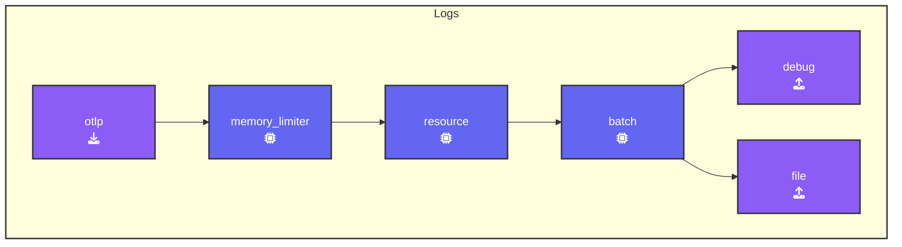

### Initial Gateway Configuration

On your machine, navigate to the directory where you're running the workshop. Create a new subdirectory called `2-gateway`, then copy the latest versions of `agent.yaml` and `trace.json` from `1-agent` into this new directory.

Next, move into the `[WORKSHOP]/2-gateway` directory and create a file named `gateway.yaml`. Copy the following starting configuration into this file.

```yaml
###########################        This section holds all the
## Configuration section ##        configurations that can be 
###########################        used in this OpenTelemetry Collector
receivers:
  otlp:                           # Receiver Type
    protocols:                    # list of Protocols used 
      http:                       # This wil enable the HTTP Protocol
        endpoint: "0.0.0.0:5318"  # Port changed to prevent conflict with agent !!!
        include_metadata: true    # Needed for token pass through mode

exporters:                        # Array of Exporters
  debug:                          # Exporter Type
    verbosity: detailed           # Enabled detailed debug output

processors:                       # Array of Processors
  memory_limiter:                 # Limits memory usage by Collectors pipeline
    check_interval: 2s            # Interval to check memory usage
    limit_mib: 512                # Memory limit in MiB
  batch:                          #Processor to Batch data before sending
    metadata_keys:                # Include token in batches
    - X-SF-Token                  # Batch data grouped by Token
  resource/add_mode:              # Processor Type/Name
    attributes:                   # Array of Attributes and modifications
    - action: upsert              # Action taken is to `insert' or 'update' a key
      key: otelcol.service.mode   # key Name
      value: "gateway"            # Key Value

###########################         This section controls what
### Activation Section  ###         configuration  will be used  
###########################         by the OpenTelemetry Collector

service:                          # Services configured for this Collector
  extensions: [health_check]      # Enabled extensions for this collector   
  pipelines:                      # Array of configured pipelines  
    traces:
      receivers:
      processors:
      - memory_limiter            # Memory Limiter processor                
      exporters:
    metrics:
      receivers:
      processors:
      - memory_limiter            # Memory Limiter processor
      exporters:
    logs:
      receivers:
      processors:
      - memory_limiter            # Memory Limiter processor
      exporters:
​
```

{}

```text
[WORKSHOP]
├── 1-agent             # Module directory
├── 2-gateway           # Module directory
│   └── agent.yaml      # OpenTelemetry Collector configuration file
│   └── gateway.yaml    # OpenTelemetry Collector configuration file
│   └── trace.json      # Sample trace data
└── otelcol             # OpenTelemetry Collector binary
```

{}

{}
We are introducing the [**batch processor**](https://github.com/open-telemetry/opentelemetry-collector/blob/main/processor/batchprocessor/README.md) with this gateway config. The Batch processor groups spans, metrics, or logs into batches, improving compression and reducing outgoing connections. It supports batching based on size and time.

For optimal performance, it is recommended to use the Batch Processor in every collector. Place it after the memory_limiter and sampling processors to ensure batching only happens after any potential data drops, such as those from sampling.
{}

In this section, we will extend the `gateway.yaml` configuration you just created to separate metric, traces & logs into different files.

{}

- **Configure File Exporters**: Separate exporters need to be configured for traces, metrics, and logs. Below is the YAML configuration for traces:

  ```yaml
    file/traces:                       # Exporter Type/Name
      path: "./gateway-traces.out"     # Path where data will be saved in OTLP json format
      append: false                    # Overwrite the file each time
  ```

- **Create similar exporters for metrics and logs**: Using the above example, set the exporter names appropriately and update the file paths to `./gateway-metrics.out` for metrics and `./gateway-logs.out` for logs.
- **Update the Pipelines Section**: Add each newly created exporter to its corresponding pipeline in the service configuration. Also, add the `batch` and `resource/add_mode` processors to each pipeline.

{}

Verify the `gateway.yaml` file at [**otelbin.io**](https://www.otelbin.io/). If configured correctly, your sections should resemble the following example for logs:


<!--

-->
