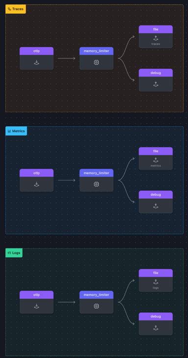

### Gateway Setup

In the location where you are running the workshop on your machine, create a sub directory called **2-gateway**, then copy the last version of the agent.yaml across to the new directory.  
Move into the *[WORKSHOP]/2-gateway* directory and create a file called **gateway.yaml**  and copy the following starting config in it.

``` text
receivers:
  otlp:
    protocols:
      http:
        endpoint: "0.0.0.0:5318" # Note, the port number is 1000 higher then the regular port number since we going to run two collectors on the same machine
processors:
  memory_limiter:
    check_interval: 2s
    limit_mib: 512

exporters:
  debug:
    verbosity: detailed

service:
  pipelines:
    traces:
      receivers: [otlp]
      processors:
        - memory_limiter
      exporters: [ debug]
    metrics:
      receivers: [otlp]
      processors:
        - memory_limiter
      exporters: [ debug]
    logs:
      receivers: [otlp]
      processors:
        - memory_limiter
      exporters: [ debug]
```

Let's start with our next exercise:

{}

* Add the following exporter

```text
  file: exporter, name it /traces: 
    path: entry, with a value of "./gateway-trace.out"
```

* Configure file size constrains. Add the following to the file exporter:

```text
    rotation: section
      max_megabytes: entry with a value of 2    * This set the max size for the file exporter output
      max_backups: entry also with a value of 2 * This will set the max number rotational backups 
```

* Add it as the first exporter in the **traces:** pipeline.
* Repeat this two more time, name them */metrics* and */logs*, with path being *./gateway-metrics.out* and *gateway-logs.out* respectively and add them to the relevant pipeline

{}

Verify your gateway.yaml with [https://www.otelbin.io/](https://www.otelbin.io/). If done correctly your view should look like this:


