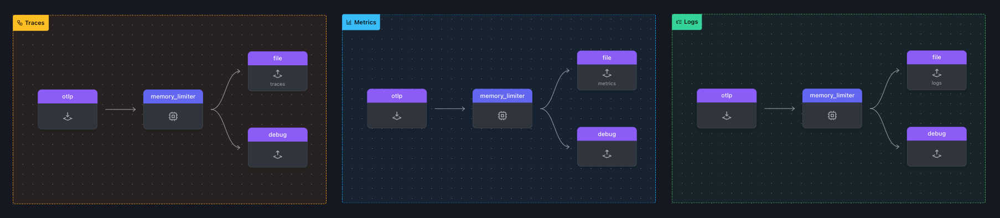

### Gateway Setup

In the location where you are running the workshop on your machine, create a new sub directory called **2-gateway**, then copy the last version of the `agent.yaml` and the `trace.json` we made earlier across to the new directory.

Move into the `[WORKSHOP]/2-gateway` directory and create a file called `gateway.yaml` and copy the following starting config in it.

```yaml
receivers:
  otlp:
    protocols:
      http:
        endpoint: "0.0.0.0:5318" # Note, the port number is 1000 higher then the regular port number since we going to run two collectors on the same machine
        include_metadata: true # Note, this will enable token pass through mode, more on this later

processors:
  memory_limiter:
    check_interval: 2s
    limit_mib: 512
  batch:
    X-SF-Token:     

exporters:
  debug:
    verbosity: detailed

service:
  pipelines:

    traces:
      receivers: [otlp]
      processors:
        - memory_limiter
      exporters: [ debug]

    metrics:
      receivers: [otlp]
      processors:
        - memory_limiter
      exporters: [ debug]

    logs:
      receivers: [otlp]
      processors:
        - memory_limiter
      exporters: [ debug]
```

Let's start with our next exercise:

{}

Lets create a separate file exporter for `traces:`, `metrics:` and `logs:`

- Add `file:` under the `exporter:` key and name it `/traces:`
  - Add `path:` key with a value of `"./gateway-traces.out"`
  - Add `rotation:` key
    - Add `max_megabytes:` key and set a value of `2` # This set the max size for the file exporter output file
    - Add `max_backups:` key and set a value of `2` # This will set the max number rotational backup it creates

- Add it as the first exporter to the exporter array in the `traces:` pipeline (leaving `debug` as a second exporter).

- Repeat the above two more time,  only name them `/metrics:` and `/logs:`, with path being `./gateway-metrics.out` and `./gateway-logs.out` respectively and add them to the relevant pipeline

{}

Verify your gateway.yaml with **[otelbin.io](https://www.otelbin.io/)**. If done correctly your view should look like this:



Note: we will explain the `batch:` key in the next section.
