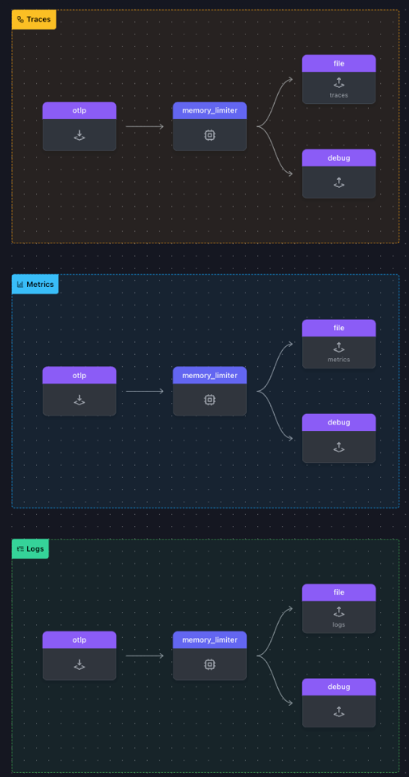
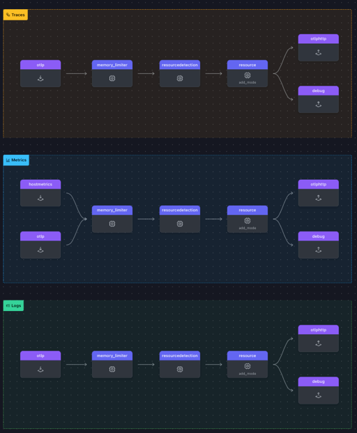

### Gateway Setup

In the location where you are running the workshop on your machine, create a sub directory called **2-gateway**, then copy the last version of the agent.yaml across to the new directory.  
Move into the *[WORKSHOP]/2-gateway* directory and create a file called **gateway.yaml**  and copy the following starting config in it.

``` text
receivers:
  otlp:
    protocols:
      http:
        endpoint: "0.0.0.0:5318" # Note, the port number is 1000 higher then the regular port number since we going to run two collectors on the same machine
processors:
  memory_limiter:
    check_interval: 2s
    limit_mib: 512

exporters:
  debug:
    verbosity: detailed

service:
  pipelines:
    traces:
      receivers: [otlp]
      processors:
        - memory_limiter
      exporters: [ debug]
    metrics:
      receivers: [otlp]
      processors:
        - memory_limiter
      exporters: [ debug]
    logs:
      receivers: [otlp]
      processors:
        - memory_limiter
      exporters: [ debug]
```

Let's start with our next exercise:

{}

* Add the following exporter

```text
  file: exporter, name it /traces: 
    path: entry, with a value of "./gateway-trace.out"
```

* Configure file size constrains. Add the following to the file exporter:

```text
    rotation: section
      max_megabytes: entry with a value of 2    * This set the max size for the file exporter output
      max_backups: entry also with a value of 2 * This will set the max number rotational backups 
```

* Add it as the first exporter in the **traces:** pipeline.
* Repeat this two more time, name them */metrics* and */logs*, with path being *./gateway-metrics.out* and *gateway-logs.out* respectively and add them to the relevant pipeline

{}

Verify your gateway.yaml with [https://www.otelbin.io/](https://www.otelbin.io/). If done correctly your view should look like this:



---

### Test Gateway

Start an other Shell, make sure your in your workhop folder and run the following command  in the new shell to test your gateway config.

```text
[LOCATION_OF_OTELCOLLECTOR]/otelcol --config=gateway.yaml
```

If you have done everything correctly, the first and the last line of the output should be:

```text
2025/01/15 15:33:53 settings.go:478: Set config to [gateway.yaml]
<snip to the end>
2025-01-13T12:43:51.747+0100 info service@v0.116.0/service.go:261	Everything is ready. Begin running and processing data.
```

---

### Change agent config

Open our agent.yaml in your editor and make the following changes:

{}

* Add the following exporter *The new preferred exporter for our backend*

```text
  otlphttp: exporter
    endpoint: entry, with a value of "http://localhost:5318"   * using the port of the gateway   
    headers: entry,
      X-SF-Token: entry, with a fake access token like "FAKE_SPLUNK_ACCESS_TOKEN"  
  ```

* Add this as the first exporter to all the sections of the pipelines.  (Remove file and leave debug in place)

{}  
  Again validate it with  [https://www.otelbin.io/](https://www.otelbin.io/), the results should look like this:



---

### Validate Agent and Gateway routing

Verify the gateway is running in its own shell and is ready to recive data, then in the agent Shell, restart the agent with:

```bash
[LOCATION_OF_OTELCOLLECTOR]/otelcol --config=agent.yaml
```

The agent should start to send *cpu* metrics again and both the agent and the gateway should reflect that in their output:

```text
<snip>
NumberDataPoints #37
Data point attributes:
     -> cpu: Str(cpu9)
     -> state: Str(system)
StartTimestamp: 2024-12-09 14:18:28 +0000 UTC
Timestamp: 2025-01-15 15:27:51.319526 +0000 UTC
Value: 9637.660000
NumberDataPoints #38
Data point attributes:
     -> cpu: Str(cpu9)
     -> state: Str(idle)
StartTimestamp: 2024-12-09 14:18:28 +0000 UTC
Timestamp: 2025-01-15 15:27:51.319526 +0000 UTC
Value: 2064591.290000
NumberDataPoints #39
Data point attributes:
     -> cpu: Str(cpu9)
     -> state: Str(interrupt)
StartTimestamp: 2024-12-09 14:18:28 +0000 UTC
Timestamp: 2025-01-15 15:27:51.319526 +0000 UTC
Value: 0.000000
	{"kind": "exporter", "data_type": "metrics", "name": "debug"}
  ```
Check if a **gateway-metrics.out** is created.

Now run the curl command to send a trace:

```text
curl -X POST -i http://localhost:4318/v1/traces \
-H "Content-Type: application/json" \
 -d @trace.json 
```

Check for the gateway-traces.out

