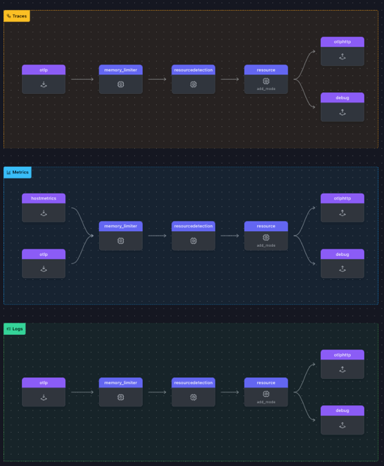

## Test Gateway

Start an other Shell, make sure your in your workhop folder and run the following command  in the new shell to test your gateway config.

```text
[LOCATION_OF_OTELCOLLECTOR]/otelcol --config=gateway.yaml
```

If you have done everything correctly, the first and the last line of the output should be:

```text
2025/01/15 15:33:53 settings.go:478: Set config to [gateway.yaml]
<snip to the end>
2025-01-13T12:43:51.747+0100 info service@v0.116.0/service.go:261	Everything is ready. Begin running and processing data.
```

---

### Change agent config

Open our agent.yaml in your editor and make the following changes:

{}

* Add the following exporter *The new preferred exporter for our backend*

```text
  otlphttp: exporter
    endpoint: entry, with a value of "http://localhost:5318"   * using the port of the gateway   
    headers: entry,
      X-SF-Token: entry, with a fake access token like "FAKE_SPLUNK_ACCESS_TOKEN"  
  ```

* Add this as the first exporter to all the sections of the pipelines.  (Remove file and leave debug in place)

{}  
  Again validate it with  [https://www.otelbin.io/](https://www.otelbin.io/), the results should look like this:



