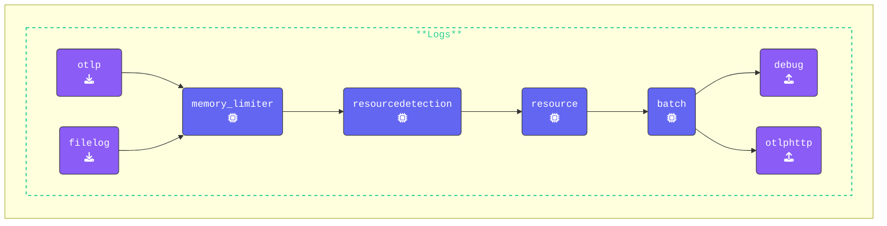

Check that you are in the `[WORKSHOP]/3-filelog` directory.  Open the `agent.yaml` copied across earlier and in your editor and add the `filelog` receiver to the `agent.yaml`.

{}

- **Add the `filelog` receiver**: The Filelog receiver reads log data from a file and includes custom resource attributes in the log data:

  ```yaml
    # Define a filelog receiver named "quotes"
    filelog/quotes:
      # Specifies the file to read log data from (quotes.log)
      include: ./quotes.log
      # Includes the full file path in the log data
      include_file_path: true
      # Excludes the file name from the log data
      include_file_name: false
      # Add custom resource attributes to the log data
      resource:
        # Sets the source of the log data to "quotes.log"
        com.splunk.source: ./quotes.log
        # Sets the sourcetype for the log data to "quotes"
        com.splunk.sourcetype: quotes
  ```

- Add `filelog/quotes` receiver to the `receivers` array in the `logs` section of the pipelines.  (make sure it also contains `otlp`)

{}

Validate the agent configuration using **[otelbin.io](https://www.otelbin.io/)**, the results for the `Logs` pipeline should look like this:



<!---->
