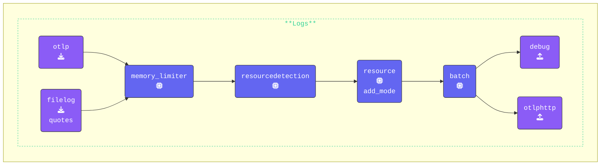

Check that you are in the `[WORKSHOP]/3-filelog` directory.  Open the `agent.yaml` copied across earlier and in your editor and add the `filelog` receiver to the `agent.yaml`.

{}

- **Add the `filelog` receiver**: The [**FileLog Receiver**](https://github.com/open-telemetry/opentelemetry-collector-contrib/blob/main/receiver/filelogreceiver/README.md) reads log data from a file and includes custom resource attributes in the log data:

  ```yaml
    filelog/quotes:                 # Receiver Type/Name                      
      include: ./quotes.log         # The file to read log data from (quotes.log)
      include_file_path: true       # Includes the full file path in the log data
      include_file_name: false      # Excludes the file name from the log data
      resource:                     # Add custom resource attributes to the log data
        com.splunk.source: ./quotes.log # Sets the source of the log data to "quotes.log"
        com.splunk.sourcetype: quotes   # Sets the sourcetype for the log data to "quotes"
  ```

- **Add `filelog/quotes` receiver** to the `receivers` array in the `logs` section of the pipelines.  (make sure it also contains `otlp`)

{}

Validate the agent configuration using **[otelbin.io](https://www.otelbin.io/)**, the results for the `Logs` pipeline should look like this:


