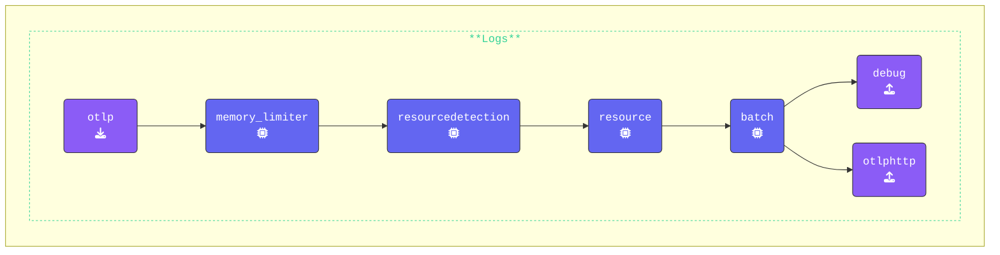

In this exercise, we will update the `extensions:` section of the `agent.yaml` file. This section is part of the OpenTelemetry configuration YAML and defines optional components that enhance or modify the OpenTelemetry Collector’s behavior.

While these components do not process telemetry data directly, they provide valuable capabilities and services to improve the Collector’s functionality.

{}

**Update the `agent.yaml`**: Add the `file_storage` extension and name it `checkpoint`:

```yaml
  file_storage/checkpoint:         # Extension Type/Name
    directory: "./checkpoint-dir"  # Define directory
    create_directory: true         # Create directory
    timeout: 1s                    # Timeout for file operations
    compaction:                    # Compaction settings
      on_start: true               # Start compaction at Collector startup
      # Define compaction directory
      directory: "./checkpoint-dir/tmp"
      # Max. size limit before compaction occurs
      max_transaction_size: 65536
```

**Add `file_storage` to existing `otlphttp` exporter**: Modify the `otlphttp:` exporter to configure retry and queuing mechanisms, ensuring data is retained and resent if failures occur:

```yaml
  otlphttp:                       # Exporter Type
    endpoint: "http://localhost:5318" # Gateway OTLP endpoint
    headers:                      # Headers to add to the HTTPcall 
      X-SF-Token: "ACCESS_TOKEN"  # Splunk ACCESS_TOKEN header
    retry_on_failure:             # Retry on failure settings
      enabled: true               # Enables retrying
    sending_queue:                # Sending queue settings
      enabled: true               # Enables Sending queue
      num_consumers: 10           # Number of consumers
      queue_size: 10000           # Maximum queue size
      # File storage extension
      storage: file_storage/checkpoint
```

**Update the `services` section**: Add the `file_storage/checkpoint` extension to the existing `extensions:` section. This will cause the extension to be enabled:

```yaml
service:
  extensions:
  - health_check
  - file_storage/checkpoint       # Enabled extensions for this collector
```

**Update the `metrics` pipeline**: For this exercise we are going to remove the `hostmetrics` receiver from the Metric pipeline to reduce debug and log noise:

```yaml
  metrics:
    receivers: 
    - otlp                        # OTLP Receiver
    # - hostmetrics               # Hostmetrics Receiver
```

{}

Validate the agent configuration using **[otelbin.io](https://www.otelbin.io/)**. For reference, the `logs:` section of your pipelines will look similar to this:


