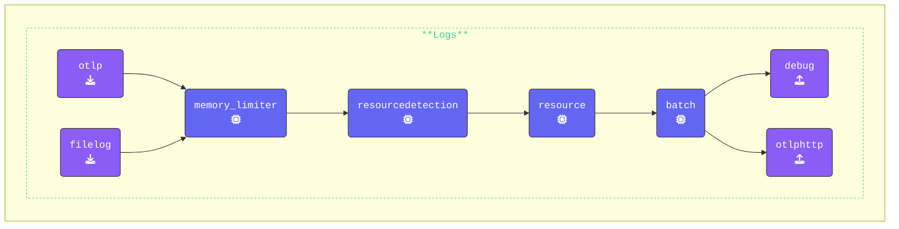

The OpenTelemetry Collector’s `file_storage` extension enhances the resilience of your telemetry pipeline by providing reliable checkpointing, managing retries, and handling temporary failures effectively.  

With this extension enabled, the OpenTelemetry Collector can store intermediate states on disk, preventing data loss during network disruptions and allowing it to resume operations seamlessly.

{}

This solution will work for metrics as long as the connection downtime is brief—up to 15 minutes. If the downtime exceeds this, Splunk Observability Cloud will drop data due to datapoints being out of order. For logs, there are plans to implement a more enterprise-ready solution in one of the upcoming OpenTelemetry Collector releases.

{}

### Setup

Inside the `[WORKSHOP]` directory, create a new subdirectory named `4-resilience`. Next, copy all contents from the `3-filelog` directory into `4-resilience`. After copying, remove any `*.out` and `*.log` files.  

Your updated directory structure should now look like this:

{}

```text
WORKSHOP
├── 1-agent
├── 2-gateway
├── 3-filelog
├── 4-resilience
│   ├── agent.yaml
│   ├── gateway.yaml
│   ├── log-gen.sh (or .ps1)
│   └── trace.json
└── otelcol
```

{}

{}
In this exercise, we will update the extensions: section of the `agent.yaml` file. This section is part of the OpenTelemetry configuration YAML and defines optional components that enhance or modify the OpenTelemetry Collector’s behavior. While these components do not process telemetry data directly, they provide valuable capabilities and services to improve the Collector’s functionality.

- **Add the `file_storage` Extension**: Define a `file_storage` extension named `checkpoint:` to store intermediate states and improve resilience.

    ```yaml
      file_storage/checkpoint:      # Extension Type/Name
        # Defines the directory where checkpoint files will be stored
        directory: "./checkpoint-dir"
        # Ensures that the directory is created if not exist 
        create_directory: true  
        # Specifies timeout for file operations for checkpointing
        timeout: 1s
        # Ensures that old checkpoint data is compacted periodically
        compaction:  
          # Controls if compaction process begins at OpenTelemetry Collector startup               
          on_start: true   
          # Specifies the directory used for compaction (as a midstep)        
          directory: "./checkpoint-dir/tmp"
          # Size limit for checkpoint transactions before compaction occurs
          max_transaction_size: 65536        
    ```

- **Extend the Existing `otlphttp` Exporter**: Modify the `otlphttp:` exporter to configure retry and queuing mechanisms, ensuring data is retained and resent if failures occur.

    ```yaml
      otlphttp:
        endpoint: "http://localhost:5318" # Gateway endpoint
        headers:
          X-SF-Token: "FAKE_SPLUNK_ACCESS_TOKEN" # or your own token
        # Controls retrying when there is a failure in sending data
        retry_on_failure:             
          enabled: true            # Enables retrying
        # Configures an internal queue to store data that couldn't be sent
        sending_queue:              
          enabled: true          # Enables Sending queue
          # Specifies the number of consumers reading from the queue
          num_consumers: 10         
          queue_size: 10000      # The maximum size of the queue
          # Specifies queue state will be backed up in the file system
          storage: file_storage/checkpoint
    ```

- **Update the `services` section**: Add the `file_storage/checkpoint` extension to the existing `extensions:` section. This will cause the extension to be enabled:

    ```yaml
    service:
      extensions: [health_check,file_storage/checkpoint]. # Enabled extensions for this collector
    ```

- **Update the `metrics` pipeline**: As we want to control the data flow for this exercise we are going to temporarily remove the `hostmetrics` receiver from the Metric pipeline:

    ```yaml
      metrics:
        receivers: 
        - otlp                        # OTLP Receiver
        # - hostmetrics                 # Hostmetrics Receiver
    ```

{}

Validate the agent configuration using **[otelbin.io](https://www.otelbin.io/)**. For reference, the `logs:` section of your pipelines will look similar to this:



This setup enables your OpenTelemetry Collector to handle network interruptions smoothly by storing telemetry data on disk and retrying failed transmissions. It combines checkpointing for recovery with queuing for efficient retries, enhancing the resilience and reliability of your pipeline. Now, let’s test the configuration!
