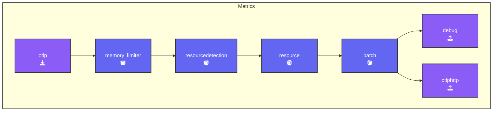

We’ll explore how to use OpenTelemetry Collector’s `file_storage` extension to enhance the resilience of your telemetry pipeline. Specifically, we’ll demonstrate how this extension helps with checkpointing, managing retries, and handling temporary failures effectively.  

By implementing this configuration, your OpenTelemetry Collector can reliably store intermediate states on disk, preventing data loss during network failures and enabling the collector to resume operations seamlessly.

{}

This solution will work for metrics as long as the connection downtime is brief—up to 15 minutes. If the downtime exceeds this, the backend may still drop data due to timing mismatches. For logs, we’re planning to implement a more enterprise-ready solution in one of the upcoming collector releases.

{}

### Setup

Create a new subdirectory named `4-resilience` and copy all contents from the `3-filelog` directory into it. Then, delete any `*.out` and `*.log` files. Your updated directory structure should now look like this:

{}

```text
WORKSHOP
├── 1-agent
├── 2-gateway
├── 3-filelog
├── 4-resilience
│   ├── agent.yaml
│   ├── gateway.yaml
│   ├── log-gen.sh (or .ps1)
│   └── trace.json
└── otelcol
```

{}

In this exercise, we will update the `agent.yaml` file by updating the `extensions:` section. This section is part of the OpenTelemetry configuration YAML, used to define optional components that enhance or modify the behavior of the OpenTelemetry Collector. These components do not handle telemetry data directly but provide additional capabilities or services to the Collector.

{}
Our first task is to implement **checkpointing** using the `file_storage` extension. The `file_storage` extension ensures that the OpenTelemetry Collector can persist checkpoints to disk, which is especially useful in the event of network failures or restarts. This allows the Collector to resume from where it left off, without losing data.

1. **Add `file_storage:` extension** and name it `checkpoint:`

```yaml
  file_storage/checkpoint:      # Extension Type/Name
    # Defines the directory where checkpoint files will be stored
    directory: "./checkpoint-dir"
    # Ensures that the directory is created if not exist 
    create_directory: true  
    # Specifies timeout for file operations for checkpointing
    timeout: 1s
    # Ensures that old checkpoint data is compacted periodically
    compaction:  
      # Controls if compaction process begins at OpenTelemetry Collector startup               
      on_start: true   
      # Specifies the directory used for compaction (as a midstep)        
      directory: "./checkpoint-dir/tmp"
      # Size limit for checkpoint transactions before compaction occurs
      max_transaction_size: 65536        
```

{}

The next exercise is modifying the `otlphttp:` exporter where retries and queuing are configured.

{}
**Extend** the existing `otlphttp` exporter:

```yaml
  otlphttp:
    endpoint: "http://localhost:5318" # Gateway endpoint
    headers:
      X-SF-Token: "FAKE_SPLUNK_ACCESS_TOKEN" # or your own token
    # Controls retrying when there is a failure in sending data
    retry_on_failure:             
      enabled: true            # Enables retrying
    # Configures an internal queue to store data that couldn't be sent
    sending_queue:              
      enabled: true          # Enables Sending queue
      # Specifies the number of consumers reading from the queue
      num_consumers: 10         
      queue_size: 10000      # The maximum size of the queue
      # Specifies queue state will be backed up in the file system
      storage: file_storage/checkpoint
```

**Update the `services` section**: Add the `file_storage/checkpoint` extension to the existing `extensions:` section. This will cause the extension to be enabled:

  ```yaml
  service:
    extensions: [health_check,file_storage/checkpoint]. # Enabled extensions for this collector   
    pipelines:
      #traces:
  ```

As we want to control the data flow for this exercise we are going to temporarily remove the `hostmetrics` receiver from the Metric pipeline:

**Update the `metrics` pipeline**: Remove the `hostmetrics` receiver from `metrics` pipeline in the `service` section like this:

  ```yaml
    metrics:
     receivers: 
     otlp                        # OTLP Receiver
     #hostmetrics                 # Hostmetrics Receiver
  ```

{}

Again, validate the agent configuration using [**otelbin.io**](https://www.otelbin.io/) for spelling mistakes etc. Your `metrics:` pipeline should like this:



<!--

-->
This setup enables your OpenTelemetry Collector to handle network interruptions smoothly by storing telemetry data on disk and retrying failed transmissions. It combines checkpointing for recovery with queuing for efficient retries, enhancing the resilience and reliability of your pipeline. Now, let’s test the configuration!
