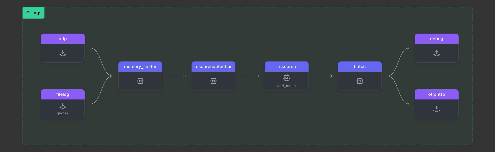

We will walk through how to use OpenTelemetry Collector’s `file_storage` extension to build resilience into your telemetry pipeline. Specifically, we will demonstrate how to use the file storage extension for checkpointing, managing retries, and handling temporary failures effectively.

The goal is to show how this configuration allows your OpenTelemetry Collector to reliably store intermediate states on disk, ensuring that no data is lost during network failures, and that the collector can resume where it left off.

{}

This solution will be effective only if the connection is down for a short period, such as up to 15 minutes. If the downtime lasts longer, the backend will eventually drop the data due to timing mismatches. While this approach will also work for logs, we plan to introduce a more robust log solution in one of the upcoming collector builds.

{}

### Setup

Create a new subdirectory named `4-resilience` and copy the contents from the `3-filelog` directory into it. Be sure to remove any `*.out` files. Your directory structure should now look like this:

{}

```text
WORKSHOP
├── 1-agent
├── 2-gateway
├── 3-filelog
├── 4-resilience
│   ├── agent.yaml
│   ├── gateway.yaml
│   ├── log-gen.sh
│   ├── quotes.log
│   └── trace.json
└── otelcol
```

{}

In this exercise, we will update the `agent.yaml` file by updating the `extensions:` section. This section is part of the OpenTelemetry configuration YAML, used to define optional components that enhance or modify the behavior of the OpenTelemetry Collector. These components do not handle telemetry data directly but provide additional capabilities or services to the Collector.

{}
The first task is to implement **checkpointing** using the `file_storage` extension. The `file_storage` extension ensures that the OpenTelemetry Collector can persist checkpoints to disk, which is especially useful in the event of network failures or restarts. This allows the Collector to resume from where it left off, without losing data.

1. **Add `file_storage:` extension** and name it `checkpoint:`

```yaml
  file_storage/checkpoint:      # Extension Type/Name
    # Defines the folder where checkpoint files will be stored
    directory: "./checkpoint-folder"   
    # Ensures that the directory is created if not exist 
    create_directory: true  
    # Specifies timeout for file operations for checkpointing
    timeout: 1s
    # Ensures that old checkpoint data is compacted periodically
    compaction:  
      # Controls if compaction process begins at OpenTelemetry Collector startup               
      on_start: true   
      # Specifies the directory used for compaction (as a midstep)        
      directory: "./checkpoint-folder/tmp"
      # Size limit for checkpoint transactions before compaction occurs
      max_transaction_size: 65_536        
```

{}

The next exercise is modifying the `otlphttp:` exporter where retries and queueing are configured.

{}
We are going to extend the existing `otlphttp` exporter:

```yaml
  otlphttp:
    endpoint: "localhost:5317"
    headers:
      X-SF-Token: "FAKE_SPLUNK_ACCESS_TOKEN" # or your own version of a token
    tls:                       # Configure Transport Layer Security
      # true disables TLS verification for the connection
      insecure: true             
    # Controls retrying when there is a failure in sending data  
    retry_on_failure:             
      enabled: true            # Enables retrying
      # Configures an internal queue to store data that couldn’t be sent
      sending_queue:              
        enabled: true          # Enables Sending queue
        # Specifies the number of consumers reading from the queue
        num_consumers: 10         
        queue_size: 10000      # The maximum size of the queue
        # Specifies queue state will be backed up in the file system
        storage: file_storage/checkpoint 
```

{}

Again, validate the agent configuration using **[otelbin.io](https://www.otelbin.io/)** for spelling mistakes etc. Your `Logs:` pipeline should like this:



This setup enables your OpenTelemetry Collector to handle network interruptions smoothly by storing telemetry data on disk and retrying failed transmissions. It combines checkpointing for recovery with queuing for efficient retries, enhancing the resilience and reliability of your pipeline. Now, let’s test the configuration!
