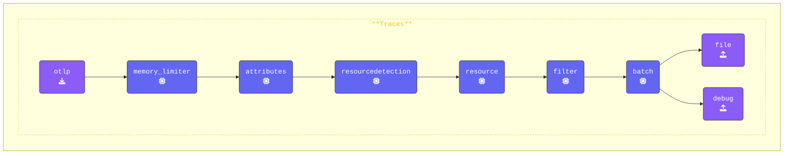

{}

Switch to your **Gateway** terminal window. Navigate to the `[WORKSHOP]/5-dropping-spans` directory and open the `gateway.yaml` and add the following configuration to the `processors` section:

- **Add a `filter` processor**: Configure the OpenTelemetry Collector to drop spans with the name `"/_healthz"`:

  ```yaml
    
    filter/health:                 # Defines a filter processor
      error_mode: ignore           # Ignore errors
      traces:                      # Filtering rules for traces
        span:                      # Exclude spans named "/_healthz"  
          - 'name == "/_healthz"'
  ```

- **Add the `filter` processor**: Make sure you add the filter to the `traces` pipeline. Filtering should be applied as early as possible, ideally *right after the* memory_limiter and *before* the batch processor.

  ```yaml
  traces:
    receivers:              # Data input sources
      - otlp
    processors:             # Processing steps in the pipeline
      - memory_limiter      # Manage memory usage
      - resourcedetection   # Add system attributes
      - resource/add_mode   # Add metadata about collector mode
      - filter/health
      - batch
    exporters:              # Output destinations
      - debug
      - file
  ```

{}

Validate the agent configuration using **[otelbin.io](https://www.otelbin.io/)**. For reference, the `traces:` section of your pipelines will look similar to this:


