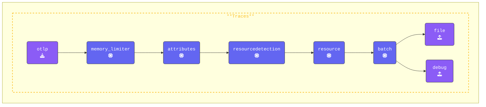
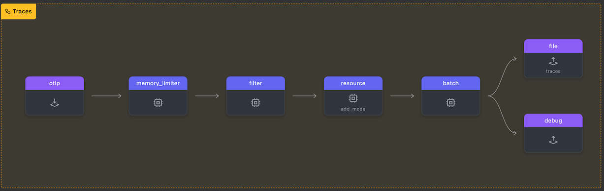

In this section, we will explore how to use the **Filter Processor** to selectively drop spans based on certain conditions.

Specifically, we will drop traces based on the span name, which is commonly used to filter out unwanted spans such as health checks or internal communication traces. In this case, we will be filtering out spans whose name is `"/_healthz"`, typically associated with health check requests.

Create a new subdirectory named `5-dropping-spans` and copy all contents from the `4-resilience` directory into it. Then, delete any `*.out` and `*.log` files. Your updated directory structure should now look like this:

{}

```text
WORKSHOP
├── 1-agent
├── 2-gateway
├── 3-filelog
├── 4-resilience
├── 5-dropping-spans
│   ├── agent.yaml
│   ├── gateway.yaml
│   ├── log-gen.sh (or .ps1)
│   └── trace.json
└── otelcol
```

{}

Open the `gateway.yaml` and add the following configuration to the `processors` section:

{}

- **Add a `filter` processor**: Configure the OpenTelemetry Collector to drop spans with the name `"/_healthz"`:

  ```yaml
    # Defines a filter processor
    filter:
      # Specifies that errors in the filter processor should be ignored
      error_mode: ignore
      # Configures filtering rules specifically for traces
      traces:
        # Applies the filter to spans within traces 
        span:
          # Excludes spans where the span name is "/_healthz"
          - 'name == "/_healthz"'
  ```

- **Add the `filter` processor**: Make sure you add the filter to the `traces` pipeline. Filtering should be applied as early as possible, ideally *right after the* memory_limiter and *before* the batch processor.

{}

Validate the gateway configuration using **[otelbin.io](https://www.otelbin.io/)**, the results for the `traces` pipeline should look like this:




