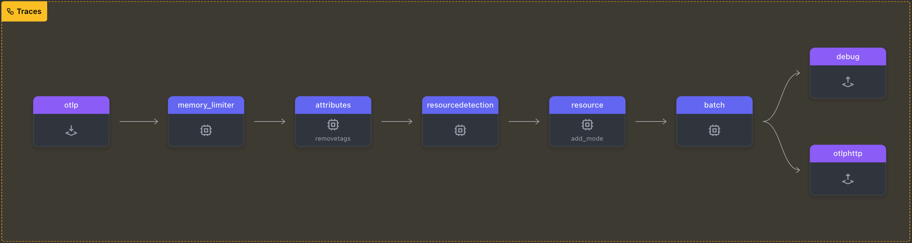

In this section, you'll learn how to configure the OpenTelemetry Collector to **remove specific tags** and **redact sensitive data** from your telemetry (spans). This is essential when dealing with sensitive information such as credit card numbers, personal data, or other security-related information that needs to be protected or anonymized.

We'll walk through how to configure several processors in the OpenTelemetry Collector, including:

- **Attributes** Processor
- **Redaction** Processor

### Setup

On your machine, navigate to the directory where you're running the workshop. Create a new subdirectory called `6-sensitive-data`, then copy the latest versions of `agent.yaml` and `trace.json` from `[WORKSHOP]\5-dropping-spans` into this new directory.

Next, move into the `[WORKSHOP]/6-sensitive-data` directory.

{}

```text
WORKSHOP
├── 1-agent
├── 2-gateway
├── 3-filelog
├── 4-resilience
├── 5-dropping-spans
├── 6-remove-sensitive-data
│   ├── gateway.yam
│   ├── agent.yam
│   ├── log-gen.sh (or .ps1)
│   ├── health.json
│   └── trace.json
└── otelcol
```

{}

In this exercise, we will update the `agent.yaml` file by adding `attributes` and `redaction` processors:

{}

- **Add a `Attributes` Processor**
The `attributes/removetags` processor allows you to delete specific attributes (tags) from spans. In this case, we're removing the tag `user.user_id`:

  ```yaml
    attributes/removetags:
      actions:
        - key: user.user_id
          action: delete
  ```

- **Update the `traces`  pipeline**: Add the `attributes/removetags:` processor into the `traces:` pipeline.

  ```yaml
      traces:
        receivers: [otlp]       # Receiver  array for traces
        processors:             # Alternative syntax option [memory_limiter]
        - memory_limiter        # Handles memory limits for this pipeline
        - attributes/removetags # Removes user.user_id attribute
        - resourcedetection     # Adds system attributes to the data
        - resource/add_mode     # Adds collector mode metadata
        - batch
        exporters: [debug,otlphttp] # Array of trace Exporters
  ```

{}

Validate the agent configuration using **[otelbin.io](https://www.otelbin.io/)**, the results for the `Traces` pipeline should look like this:


