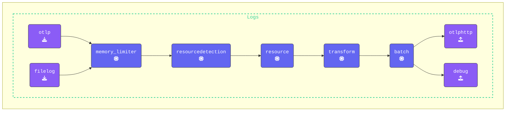
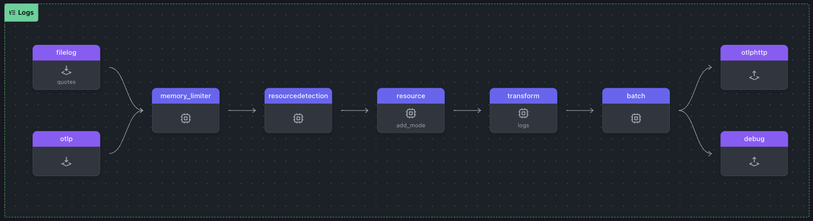

The **Transform Processor** lets you modify telemetry data—logs, metrics, and traces—as it flows through the pipeline. Using the **OpenTelemetry Transformation Language (OTTL)**, you can filter, enrich, and transform data on the fly without touching your application code.

In this exercise, we'll focus on using the Transform Processor with OTTL to filter, parse, and transform JSON-structured log data.

### Setup

Create a new subdirectory named `7-transform-data` and copy all contents from the `6-sensitive-data` directory into it. Then, delete any `*.out` and `*.log` files. Your updated directory structure should now look like this:

{}

```text
WORKSHOP
├── 1-agent
├── 2-gateway
├── 3-filelog
├── 4-resilience
├── 5-dropping-spans
├── 6-sensitive-data
├── 7-transform-data
│   ├── gateway.yaml
│   ├── agent.yaml
│   ├── log-gen.sh (or .ps1)
│   ├── health.json
│   └── trace.json
└── otelcol
```

{}

We’ll update `agent.yaml` to include a Transform Processor that will:
- **Filter** log resource attributes
- **Parse** JSON structured log data into attributes
- **Set** log severity levels based on the log message body


You may have noticed that in previous logs, fields like SeverityText and SeverityNumber were undefined (this is typical of the filelog receiver) However, the severity is embedded within the log body:

```text
<snip>
LogRecord #0
ObservedTimestamp: 2025-01-31 21:49:29.924017 +0000 UTC
Timestamp: 1970-01-01 00:00:00 +0000 UTC
SeverityText: WARN
SeverityNumber: Unspecified(0)
Body: Str(2025-01-31 15:49:29 [WARN] - Do or do not, there is no try.)
Attributes:
     -> log.file.path: Str(quotes.log)
Trace ID:
Span ID:
Flags: 0
  {"kind": "exporter", "data_type": "logs", "name": "debug"}
```
Logs often contain structured data encoded as JSON within the log body. Extracting these fields into attributes allows for better indexing, filtering, and querying. Instead of manually parsing JSON in downstream systems, OTTL enables automatic transformation at the telemetry pipeline level.

We’ll correct this using the Transform Processor. 

{}

- **Configure the `transform(logs)` processor:** Ensure the processor is applied to `log_statements` in the `resource` context and filter the resource attributes, keeping only relevant metadata fields (`com.splunk.sourcetype`, `host.name`, `otelcol.service.mode`):

  ```yaml
  transform/logs:
    log_statements: 
      - context: resource
        statements:
          - keep_keys(attributes, ["com.splunk.sourcetype","host.name", "otelcol.service.mode"])
  ```

- **Add another context block** for to the `log_statements` and set the severity_text and severity_number of the log record based on the matching severity level from the log body.

  ```yaml
      - context: log
        statements:
          - set(cache, ParseJSON(body)) where IsMatch(body, "^\\{")
          - flatten(cache, "")
          - merge_maps(attributes, cache, "upsert")
          - set(severity_text, attributes["level"])
          - set(severity_number, 1) where severity_text == "TRACE"
          - set(severity_number, 5) where severity_text == "DEBUG"
          - set(severity_number, 9) where severity_text == "INFO"
          - set(severity_number, 13) where severity_text == "WARN"
          - set(severity_number, 17) where severity_text == "ERROR"
          - set(severity_number, 21) where severity_text == "FATAL"

  ```

{}
This transformation checks if the log body contains a JSON object, then extracts its fields into log attributes with merge_maps while preserving nested structures. The flattened(cache) step ensures that deeply nested JSON fields can be accessed as top-level attributes.

This method should only be used for **testing and debugging OTTL**. Mapping all fields from a JSON object would cause high cardinality in production scenarios.
{}

- **Update the `logs` pipeline**: Add the `transform` processor into the `logs:` pipeline:

  ```yaml
  logs:                                   # Logs Pipeline
      receivers: [filelog/quotes, otlp]   # Array of receivers in this pipeline
      processors:         # Array of Processors in this pipeline
      - memory_limiter    # You also could use [memory_limiter]
      - resourcedetection
      - resource/add_mode
      - transform/logs
      - batch
  ```

{}

Validate the agent configuration using **[otelbin.io](https://www.otelbin.io/)**, the results for the `Logs` pipeline should look like this:



<!---->
