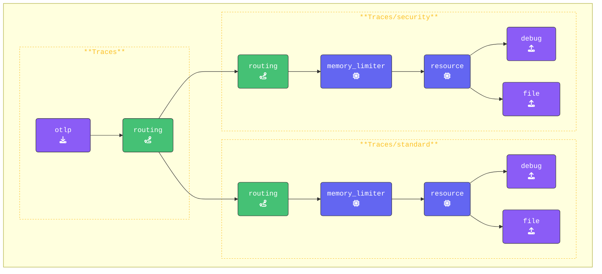

{}

**Add both the `standard` and `security` traces pipelines**:

1. **Standard pipeline**: This pipeline processes all spans that do not match the routing rule. Add it below the existing `traces:` pipeline, keeping the configuration unchanged for now:

    ```yaml
      traces/standard:                # Default pipeline for unmatched spans
        receivers: 
        - routing                     # Receive data from the routing connector
        processors:
        - memory_limiter              # Limits memory usage
        - resource/add_mode           # Adds collector mode metadata
        exporters:
        - debug                       # Debug exporter
        - file/traces/standard        # File exporter for unmatched spans
    ```

2. **Security pipeline**: This pipeline will handle all spans that match the routing rule:

    ```yaml
        traces/security:                # New Security Traces/Spans Pipeline       
          receivers: 
          - routing                     # Routing Connector, Only receives data from Connector
          processors:
          - memory_limiter              # Memory Limiter Processor
          - resource/add_mode           # Adds collector mode metadata
          exporters:
          - debug                       # Debug Exporter 
          - file/traces/security        # File Exporter for spans matching rule
    ```

**Update the `traces` pipeline to use routing**:

1. To enable `routing`, update the original `traces:` pipeline by adding `routing` as an exporter. This ensures all span data is sent through the routing connector for evaluation.

2. Remove all processors as these are now defined in the `traces/standard` and `traces/security` pipelines.

    ```yaml
      pipelines:
        traces:                           # Original traces pipeline
          receivers: 
          - otlp                          # OTLP Receiver
          processors:
          exporters: 
          - routing                       # Routing Connector
    ```

{}

{}
By excluding the batch processor, spans are written immediately instead of waiting for multiple spans to accumulate before processing. This improves responsiveness, making the workshop run faster and allowing you to see results sooner.
{}

Validate the agent configuration using **[otelbin.io](https://www.otelbin.io/)**. For reference, the `traces:` section of your pipelines will look similar to this:



Lets' test our configuration!
