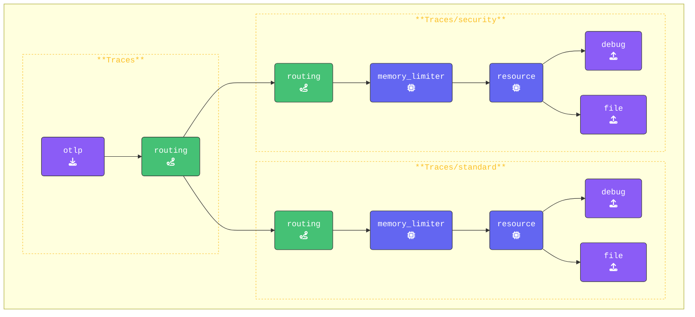
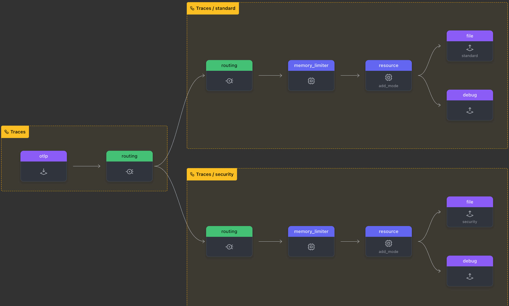

{}

- **Add both the `standard` and `security` traces pipelines**:

  1. **Standard pipeline**: This pipeline will handle all spans that do not match the routing rule. Add it below the regular `traces:` pipeline, and leave the configuration unchanged for now.

  ```yaml
    pipelines:
      traces/standard:                # New Default Traces/Spans Pipeline    
        receivers: 
        - routing                     # Routing Connector, Only receives data from Connector
        processors:
        - memory_limiter              # Memory Limiter Processor
        - resource/add_mode           # Adds collector mode metadata
        exporters:
        - debug                       # Debug Exporter
        - file/traces/standard        # File Exporter for spans NOT matching rule
  ```

  - **Target pipeline**: This pipeline will handle all spans that match the routing rule.

  ```yaml
    pipelines:
      traces/security:                # New Security Traces/Spans Pipeline       
        receivers: 
        - routing                     # Routing Connector, Only receives data from Connector
        processors:
        - memory_limiter              # Memory Limiter Processor
        - resource/add_mode           # Adds collector mode metadata
        exporters:
        - debug                       # Debug Exporter 
        - file/traces/security        # File Exporter for spans matching rule
  ```

- **Update the `traces` pipeline to use routing**: To enable `routing`, update the original `traces:` pipeline by adding `routing` as an exporter. This ensures that all span data is sent through the routing connector for evaluation.

For clarity, we are removing the `debug` exporter from this pipeline, so that debug output is only shown from the new exporters behind the routing connector.

```yaml
  pipelines:
    traces:                           # Original traces pipeline
      receivers: 
      - otlp                          # Debug Exporter            
      exporters: 
      - routing                       # Routing Connector, Only exports data to Connector
```

{}

Keep in mind that any existing processors have been removed from this pipeline. They are now handled by either the standard pipeline or the target pipelines, depending on the routing rules.

Additionally, the `batch` processor has been removed from the new pipelines. This ensures that `spans` are written immediately, rather than waiting for multiple spans to arrive before processing. This change speeds up the workshop and allows you to see results faster.
{}

{}

Again, validate the **Gateway** configuration using `otelbin.io` for spelling mistakes etc. Your `Traces:` pipeline should like this:



<!---->

Lets' test our configuration!
