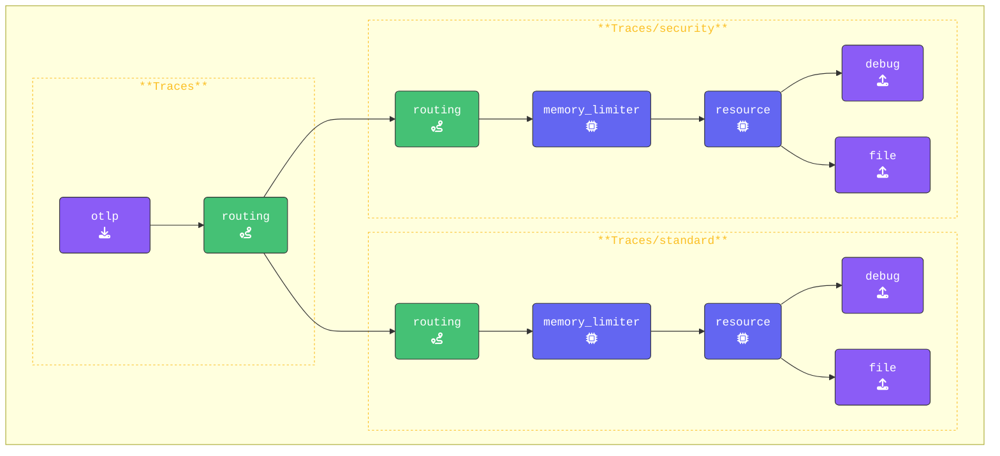

The routing connector in OpenTelemetry is a powerful feature that allows you to direct data (`traces`, `metrics`, or l`ogs`) to different pipelines based on specific criteria. This is especially useful in scenarios where you want to apply different processing or exporting logic to subsets of your telemetry data.

For example, you might want to send *production* data to one exporter while directing *test* or *development* data to another. Similarly, you could route certain spans based on their attributes, such as service name, environment, or span name, to apply custom processing or storage logic.

### Setup

Create a new subdirectory named `8-routing` and copy all contents from the `7-transform-data` directory into it. Then, delete any `*.out` and `*.log` files. Your updated directory structure should now look like this:

{}

```text
WORKSHOP
├── 1-agent
├── 2-gateway
├── 3-filelog
├── 4-resilience
├── 5-dropping-spans
├── 6-sensitive-data
├── 7-transform-data
├── 8-routing
│   ├── agent.yaml
│   ├── gateway.yaml
│   ├── log-gen.sh (or .ps1)
│   ├── health.json
│   └── trace.json
└── otelcol
```

{}

In the following exercise, you will configure the `routing connector` in the `gateway.yaml` file. This setup will enable the `gateway` to route traces based on the `deployment.environment` attribute in the spans you send. By doing so, you can process and handle traces differently depending on their attributes.

{}
Open the `gateway.yaml` and add the following configuration:

- **Add the `connectors:` section**:  
In OpenTelemetry configuration files, `connectors` have their own dedicated section, similar to receivers and processors. In the `gateway.yaml`file, insert the `connectors:` section below the receivers section and above the processors section.

  ```yaml
  connectors:       # Section to configure connectors

  processors:
    #memory_limiter:

  ```

- **Add the `routing` connector**:  
  In this configuration, spans will be routed if the `deployment.environment` resource attribute matches `"security_applications"`.

  This same approach can also be applied to `metrics` and `logs`, allowing you to route them based on attributes in `resourceMetrics` or `resourceLogs` similarly. Add the following under the `connectors:` section:

  ```yaml
    routing:
      default_pipelines: [traces/standard] # Default pipeline to use if no matching rule
      error_mode: ignore                   # Ignore errors in the routing 
      table:                               # Array with routing rules
        # Connector will route any span to target pipeline if if the resourceSpn attribute matches this rule 
        - statement: route() where attributes["deployment.environment"] == "security_applications"
          pipelines: [traces/security]     # Target pipeline 
  ```

- **Configure two `file:` Exporters**:
The `routing connector` requires different targets for routing. To achieve this, update the default `file/traces:` exporter and name it `file/traces/default` and add a second file exporter called `file/traces/security:`. This will allow the routing connector to direct data to the appropriate target based on the rules you define.

  ```yaml
    file/traces/standard:               # Exporter Type/Name (For regular traces)
      # Path where trace data will be saved in OTLP json format 
      path: "./gateway-traces-standard.out" 
      append: false    # Overwrite the file each time
    file/traces/security:              # Exporter Type/Name (For security traces)
      # Path where trace data will be saved in OTLP json format
      path: "./gateway-traces-security.out" 
      append: false                    # Overwrite the file each time 
  ```

- **Add both the `standard` and `security traces` pipelines**:
To enable routing we need to define two pipelines for traces:

  1. **Standard** pipeline.  
  This pipeline will handle all spans that do not match the routing rule. Add it below the regular `traces:` pipeline, and leave the configuration unchanged for now.

  ```yaml
    pipelines:
      #traces:               
      traces/standard:                # New Default Traces/Spans Pipeline    
        receivers: 
        - routing                     # Routing Connector, Only receives data from Connector
        processors:
        - memory_limiter              # Memory Limiter Processor
        - resource/add_mode           # Adds collector mode metadata
        exporters:
        - debug                       # Debug Exporter
        - file/traces/standard        # File Exporter for spans NOT matching rule
  ```

  - The Target pipeline, that will handle all spans that match the routing rule.

  ```yaml
    pipelines:
      #traces:
      #traces/standard:
      traces/security:                # New Security Traces/Spans Pipeline       
        receivers: 
        - routing                     # Routing Connector, Only receives data from Connector
        processors:
        - memory_limiter              # Memory Limiter Processor
        - resource/add_mode           # Adds collector mode metadata
        exporters:
        - debug                       # Debug Exporter 
        - file/traces/security        # File Exporter for spans matching rule
      #metrics:
  ```

- **Update the `traces` pipeline to handle routing**:  
To enable `routing`, update the original `traces:` pipeline by adding `routing` as an exporter. This ensures that all span data is sent through the routing connector for evaluation.

For clarity, we are removing the `debug` exporter from this pipeline, so that debug output is only shown from the new exporters behind the routing connector.

```yaml
  pipelines:
    traces:                           # Original traces pipeline
      receivers: 
      - otlp                          # Debug Exporter            
      exporters: 
      - routing                       # Routing Connector, Only exports data to Connector
```

{}

Keep in mind that any existing processors have been removed from this pipeline. They are now handled by either the standard pipeline or the target pipelines, depending on the routing rules.

Additionally, the `batch` processor has been removed from the new pipelines. This ensures that `spans` are written immediately, rather than waiting for multiple spans to arrive before processing. This change speeds up the workshop and allows you to see results faster.
{}

{}

Again, validate the `gateway` configuration using `otelbin.io` for spelling mistakes etc. Your `Traces:` pipeline should like this:



<!---->

Lets' test our configuration!
