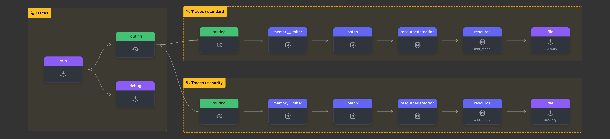

The routing processor allows you to route data to different destinations based on the attributes of the data. The routing processor can be used to send data to different backends based on the attributes of the data. For example, you can use the routing processor to send data to different backends based on the service name or the environment.



Directory structure testing:

```text
your_project/
├── checkpoint-folder/
├── otel-collector-config.yaml  # Configuration file
├── agent-standard.out         # Trace export file
├── agent-security.out         # Security trace export file
```
