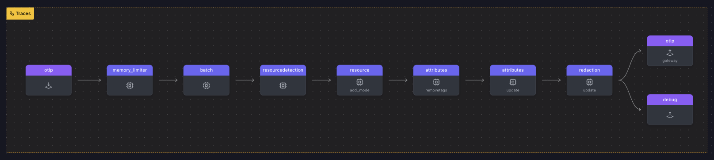

In this section, you'll learn how to configure the OpenTelemetry Collector to remove specific tags and redact sensitive data from your telemetry (traces). This is essential when dealing with sensitive information such as credit card numbers, personal data, or other security-related information that needs to be protected or anonymized.

We'll walk through how to configure several processors in the OpenTelemetry Collector, including:

- **Removing Tags**.
- **Redacting Sensitive Data** (such as credit card numbers and account credentials).
- **Using regular expressions to block sensitive data**.

By the end of this workshop, you'll have a working OpenTelemetry Collector configuration that securely handles sensitive telemetry data.

Here’s a breakdown of the main components:

Processors: These will handle the data removal and redaction.
Batch Processor: We'll use it to control how traces are batched and exported.
Memory Limiter: Ensures that the collector does not consume too much memory.
Redaction Processor: A dedicated processor for redacting sensitive data, including credit card numbers and account details.

### Step 1: Initial Setup

On your machine, navigate to the directory where you're running the workshop. Create a new subdirectory called `6-remove-sensitive-data`, then copy the latest versions of `agent.yaml` and `trace.json` from `1-agent` into this new directory.

Next, move into the `[WORKSHOP]/6-remove-sensitive-data` directory.

```text
WORKSHOP
├── 1-agent
├── 2-gateway
├── 3-filelog
├── 4-resilience
├── 5-dropping-spans
├── 6-remove-sensitive-data
│   ├── agent.yaml
│   └── trace.json
└── otelcol
```

#### 1.2 Setup and Review Simulated Trace Data

For this section, you'll need to generate some trace data that includes sensitive data.

{}
Copy the following JSON and save to the file named `trace.json` in the `6-remove-sensitive-data` directory:

{}
{}

```json
{"resourceSpans":[{"resource":{"attributes":[{"key":"service.name","value":{"stringValue":"my.service"}},{"key":"deployment.environment","value":{"stringValue":"my.environment"}}]},"scopeSpans":[{"scope":{"name":"my.library","version":"1.0.0","attributes":[{"key":"my.scope.attribute","value":{"stringValue":"some scope attribute"}}]},"spans":[{"traceId":"5B8EFFF798038103D269B633813FC60C","spanId":"EEE19B7EC3C1B174","parentSpanId":"EEE19B7EC3C1B173","name":"I'm a server span","startTimeUnixNano":"1544712660000000000","endTimeUnixNano":"1544712661000000000","kind":2,"attributes":[{"key":"user.name","value":{"stringValue":"George Lucas"}},{"key":"user.user_id","value":{"stringValue":"oldbenkenobi"}},{"key":"user.phone_number","value":{"stringValue":"+1555-867-5309"}},{"key":"user.email","value":{"stringValue":"george@deathstar.email"}},{"key":"user.account_password","value":{"stringValue":"LOTR>StarWars1-2-3"}},{"key":"user.visa","value":{"stringValue":"4111 1111 1111 1111"}},{"key":"user.amex","value":{"stringValue":"3782 822463 10005"}},{"key":"user.mastercard","value":{"stringValue":"5555 5555 5555 4444"}}]}]}]}]}
```

{}

{}

```json
{
  "resourceSpans": [
    {
      "resource": {
        "attributes": [
          {
            "key": "service.name",
            "value": {
              "stringValue": "my.service"
            }
          },
          {
            "key": "deployment.environment",
            "value": {
              "stringValue": "my.environment"
            }
          }
        ]
      },
      "scopeSpans": [
        {
          "scope": {
            "name": "my.library",
            "version": "1.0.0",
            "attributes": [
              {
                "key": "my.scope.attribute",
                "value": {
                  "stringValue": "some scope attribute"
                }
              }
            ]
          },
          "spans": [
            {
              "traceId": "5B8EFFF798038103D269B633813FC60C",
              "spanId": "EEE19B7EC3C1B174",
              "parentSpanId": "EEE19B7EC3C1B173",
              "name": "I'm a server span",
              "startTimeUnixNano": "1544712660000000000",
              "endTimeUnixNano": "1544712661000000000",
              "kind": 2,
              "attributes": [
                {
                  "key": "user.name",
                  "value": {
                    "stringValue": "George Lucas"
                  }
                },
                {
                  "key": "user.user_id",
                  "value": {
                    "stringValue": "oldbenkenobi"
                  }
                },
                {
                  "key": "user.phone_number",
                  "value": {
                    "stringValue": "+1555-867-5309"
                  }
                },
                {
                  "key": "user.email",
                  "value": {
                    "stringValue": "george@deathstar.email"
                  }
                },
                {
                  "key": "user.account_password",
                  "value": {
                    "stringValue": "LOTR>StarWars1-2-3"
                  }
                },
                {
                  "key": "user.visa",
                  "value": {
                    "stringValue": "4111 1111 1111 1111"
                  }
                },
                {
                  "key": "user.amex",
                  "value": {
                    "stringValue": "3782 822463 10005"
                  }
                },
                {
                  "key": "user.mastercard",
                  "value": {
                    "stringValue": "5555 5555 5555 4444"
                  }
                }
              ]
            }
          ]
        }
      ]
    }
  ]
}
```

{}
{}
{}


### Step 2: Configure Agent

In this exercise, we will update the `agent.yaml` file by adding `attributes` and `redaction` processors.

### Breakdown of Key Configurations

#### 2.1 Remove Tags (Attributes)

The `attributes/removetags` processor allows you to delete specific attributes (tags) from spans. In this case, we're removing the tag `user.user_id`:
The `attributes/removetags` processor allows you to delete specific attributes (tags) from spans. In this case, we're removing the tag `user.user_id`:

```yaml
attributes/removetags:
  actions:
    - key: user.user_id
    - key: user.user_id
      action: delete
```

#### 2.2. Update Sensitive Data

The attributes/update processor is used to update or redact sensitive data. We perform the following actions:

Redacting credit card numbers: Replace the amex card number with the word "redacted".
Redacting credit card numbers: Replace the amex card number with the word "redacted".
Deleting the account_password field to remove passwords from traces.
Hashing the account_email to anonymize email addresses.

```yaml
attributes/update:
  actions:
    - key: user.amex
    - key: user.amex
      value: redacted
      action: update
    - key: user.account_password
    - key: user.account_password
      action: delete
    - key: user.account_email
    - key: user.account_email
      action: hash
```

#### 2.3. Redaction Processor

The redaction/update processor provides fine-grained control over which attributes are allowed or blocked from traces. We configure this processor to:

Block sensitive data: Credit card numbers matching the provided regex patterns (Visa and MasterCard) will be blocked and redacted.

```yaml
redaction/update:
  allow_all_keys: true
  blocked_values:
    - "4[0-9]{12}(?:[0-9]{3})?"  # Visa card regex
    - "(5[1-5][0-9]{14})"         # MasterCard card regex
  summary: debug  # Show detailed debug information about redactions
```

In the next exercise you will configure the processors and add to the `traces` pipeline.

{}

- **Configure the processors**:
Open the `agent.yaml` and add the `attributes/removetags`, `attributes/update`, and `redaction/update` configuration to the `processors` section

- **Add the `attribute` and `redaction` processors**: Make sure you add the processors to the `traces` pipeline.

- **Validate the agent configuration**:
Using **[otelbin.io](https://www.otelbin.io/)**, the results for the `traces` pipeline should look like this:
{}


