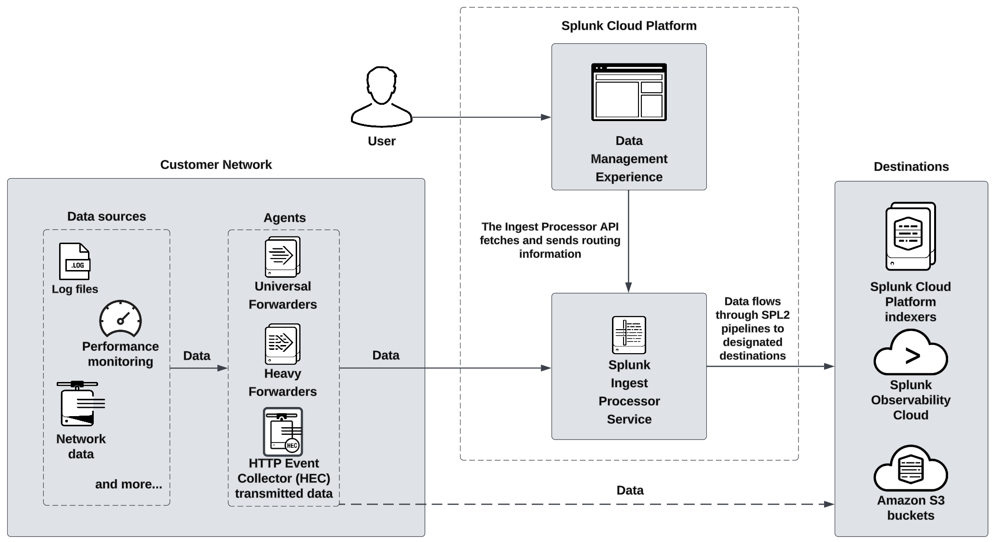

###### System architecture

The primary components of the Ingest Processor service include the Ingest Processor service and SPL2 pipelines that support data processing. The following diagram provides an overview of how the components of the Ingest Processor solution work together:

###### Ingest Processor service

The Ingest Processor service is a cloud service hosted by Splunk. It is part of the data management experience, which is a set of services that fulfill a variety of data ingest and processing use cases.

You can use the Ingest Processor service to do the following:

* Create and apply SPL2 pipelines that determine how each Ingest Processor processes and routes the data that it receives.
* Define source types to identify the kind of data that you want to process and determine how the Ingest Processor breaks and merges that data into distinct events.
* Create connections to the destinations that you want your Ingest Processor to send processed data to.

###### Pipelines

A pipeline is a set of data processing instructions written in SPL2. When you create a pipeline, you write a specialized SPL2 statement that specifies which data to process, how to process it, and where to send the results. When you apply a pipeline, the Ingest Processor uses those instructions to process all the data that it receives from data sources such as Splunk forwarders, HTTP clients, and logging agents.

Each pipeline selects and works with a subset of all the data that the Ingest Processor receives. For example, you can create a pipeline that selects events with the source type `cisco_syslog` from the incoming data, and then sends them to a specified index in Splunk Cloud Platform. This subset of selected data is called a partition. For more information, see [Partitions](http://docs.splunk.com/Documentation/SplunkCloud/latest/IngestProcessor/Architecture#Partitions).

The Ingest Processor solution supports only the commands and functions that are part of the `IngestProcessor` profile. For information about the specific SPL2 commands and functions that you can use to write pipelines for Ingest Processor, see [Ingest Processor pipeline syntax](http://docs.splunk.com/Documentation/SplunkCloud/latest/IngestProcessor/PipelinesOverview). For a summary of how the `IngestProcessor` profile supports different commands and functions compared to other SPL2 profiles, see the following pages in the *SPL2 Search Reference*:

* [Compatibility Quick Reference for SPL2 commands](http://docs.splunk.com/Documentation/SCS/current/SearchReference/CompatibilityQuickReferenceforSPL2commands)
* [Compatibility Quick Reference for SPL2 evaluation functions](http://docs.splunk.com/Documentation/SCS/current/SearchReference/CompatibilityQuickReferenceforSPL2evaluationfunctions)