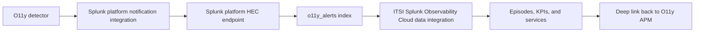

Splunk Observability Cloud can send detector alert and clear notifications to Splunk platform. ITSI can use those events for third-party alerting, notable event aggregation, and service health.

## Use the Packaged Accelerator

For a real workshop, start with the packaged Splunk content instead of building every KPI search from scratch:

1. Install **Splunk App for Content Packs** in the Splunk platform environment that runs ITSI.
2. Install **Splunk Infrastructure Monitoring Add-on** and configure it with access to the Observability Cloud organization.
3. Install **Content Pack for Splunk Observability Cloud** from the Content Library.
4. Review the prebuilt KPIs, services, dashboards, and glass tables.
5. Layer the Astronomy Shop business transaction model on top of that packaged content.

The add-on and content pack help with Observability Cloud metric visibility in ITSI. The alert/event path below is still useful for detector trigger and clear events, episode aggregation, and incident routing.

{}
Do not treat the content pack as the detector-alert ingestion mechanism. The content pack accelerates ITSI metric content and views. To get Observability Cloud detector trigger and clear events into ITSI episodes, configure the Observability Cloud alert integration to Splunk platform and point ITSI at that alert index.
{}

## Integration Pattern

There is a supported connector path, but it is alert/event based:



Use this pattern to teach the integration:

| Layer | What it does | Workshop task |
|---|---|---|
| Observability Cloud detector | Detects service, transaction, or SLO symptoms. | Create detectors grouped by `business.transaction`. |
| Splunk platform notification integration | Sends alert and clear events to Splunk platform through HEC. | Configure the Splunk platform integration in Observability Cloud. |
| ITSI data integration | Normalizes Observability Cloud alert events for third-party alerting. | Point ITSI at the alert index and map fields. |
| ITSI services and episodes | Converts technical alerts into service health and business impact. | Build business transaction services, KPIs, and aggregation policies. |

{}
The packaged content accelerates metrics, KPIs, and dashboards. The alert connector handles detector events. Neither path automatically turns the APM service map into the business transaction model for this workshop; the map you built earlier is the bridge between O11y telemetry and ITSI business services.
{}

## Configure HEC

In Splunk platform:

1. Create or choose an index for Observability Cloud alert events, for example `o11y_alerts`.
2. Create a HEC token that writes to that index.
3. Confirm indexer acknowledgement is not enabled for the token used by the Observability Cloud integration.
4. Record the HEC base URL and token.

## Configure the Splunk Platform Integration

In Splunk Observability Cloud:

1. Go to **Data Management**.
2. Open **Available integrations**.
3. Select **Splunk platform**.
4. Create a new integration with your HEC URL and token.
5. Keep the default payload unless your ITSI team requires extra fields.
6. Save the integration.

Observability Cloud sends notifications when a detector alert triggers and when it clears.

## Verify Events

Trigger a test alert or wait for the workshop issue. Then search Splunk platform:

```spl
index=o11y_alerts sflo_dimensions
| table _time sflo_event_type sflo_detector sflo_dimensions
| sort - _time
```

If the `sflo_dimensions` field is visible, the payload is available for ITSI rules and KPI searches.

## Push Demo Events

When you want to teach the ITSI functions before real detectors are configured, push a tiny set of detector-like events directly to the Splunk HEC endpoint:

```bash
cd workshop/observing-business-journeys

export SPLUNK_HEC_URL=https://<splunk-host>:8088
export SPLUNK_HEC_TOKEN=<hec-token>
export SPLUNK_HEC_INDEX=o11y_alerts
export SPLUNK_HEC_INSECURE=true

./scripts/push-demo-events.sh trigger checkout
./scripts/push-demo-events.sh trigger cart
./scripts/push-demo-events.sh clear checkout
```

The generated payload uses the same business fields as the real detector path:

| Field | Example |
|---|---|
| `business_application` | `astronomy-shop` |
| `business_transaction` | `Complete Checkout` |
| `business_capability` | `checkout` |
| `business_criticality` | `critical` |
| `impacted_service` | `payment` |
| `sflo_event_type` | `detector_triggered` or `detector_cleared` |

{}
The demo pusher is only for proving ITSI services, KPIs, episodes, and glass tables. It sends a few alert-shaped events to Splunk platform and does not replace the production Observability Cloud detector integration.
{}

## ITSI Integration Check

In ITSI:

1. Go to **Configuration** then **Data Integrations** or the third-party alerting setup area for your ITSI version.
2. Confirm **Splunk Observability Cloud** is listed as an available integration.
3. Use the same incoming alert index when configuring searches and aggregation policies.

{}
Different Splunk platform configurations can extract JSON fields differently. The examples in this workshop use `spath` and `coalesce` so they work whether fields are extracted automatically or left inside the raw payload.
{}
