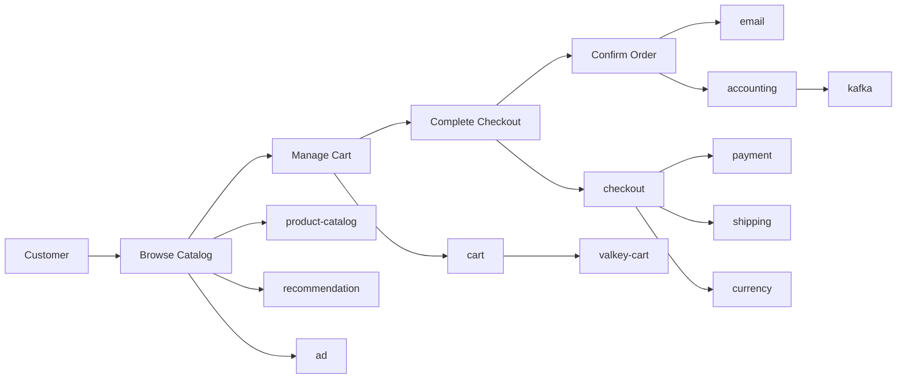

Modern service maps are excellent at showing technical dependencies, but incident leaders also need to know which customer journey, revenue stream, or operating process is at risk. This workshop uses the OpenTelemetry Astronomy Shop to teach a repeatable method for mapping microservices to business transactions, feeding that context into Splunk Observability Cloud, and using Splunk IT Service Intelligence (ITSI) to display business impact when an issue appears.

The runnable lab is designed for a laptop with Minikube. Astronomy Shop runs locally in Kubernetes, telemetry is sent to Splunk Observability Cloud through the Splunk Distribution of the OpenTelemetry Collector, and ITSI receives Observability Cloud detector alerts through the Splunk platform integration.

## Workshop Goals

- Deploy the OpenTelemetry Astronomy Shop locally in Minikube.
- Map services, routes, dependencies, and owners to business transactions.
- Enrich traces with `business.application`, `business.transaction`, `business.capability`, and `business.criticality` attributes.
- Compare collector enrichment, auto instrumentation, and application-owned custom instrumentation.
- Create APM MetricSets, dashboards, and detectors that use business context.
- Send Observability Cloud alerts into Splunk platform and ITSI.
- Model ITSI services, KPIs, dependencies, episodes, and a glass table around customer-impacting journeys.
- Inject controlled failures and show the difference between technical root cause and business impact.

## Lab Files

The runnable assets for this workshop are in:

```text
workshop/observing-business-journeys/
```

The key files are:

| File | Purpose |
|---|---|
| `scripts/deploy-minikube.sh` | Starts or reuses a Minikube profile, installs the Splunk collector, and deploys Astronomy Shop. |
| `scripts/set-flag.sh` | Enables or clears built-in Astronomy Shop failure scenarios. |
| `values/splunk-otel-collector-values.yaml` | Adds business transaction attributes to spans in the collector trace pipeline. |
| `values/otel-demo-values.yaml` | Configures Astronomy Shop to send OTLP telemetry to the node-local Splunk collector. |
| `instrumentation/auto-instrumentation-example.yaml` | Optional OpenTelemetry Operator example for auto-instrumenting an added service. |
| `instrumentation/custom-instrumentation-examples.md` | App-code examples for adding business attributes directly to spans. |
| `mappings/astronomy-shop-business-map.yaml` | Working service-to-business transaction map for the lab. |
| `itsi/o11y-alert-kpi-searches.md` | ITSI KPI and episode search examples for Observability Cloud alert payloads. |

## Business Journey Model



## References

- [OpenTelemetry Astronomy Shop demo](https://github.com/splunk/edu-opentelemetry-demo)
- [OpenTelemetry demo feature flags](https://opentelemetry.io/docs/demo/feature-flags/)
- [Splunk OpenTelemetry Collector for Kubernetes Helm chart](https://github.com/signalfx/splunk-otel-collector-chart)
- [Set up the OpenTelemetry demo in Kubernetes for Splunk Observability Cloud](https://lantern.splunk.com/Observability_Use_Cases/Optimize_Costs/Setting_up_the_OpenTelemetry_Demo_in_Kubernetes)
- [Send alerts to Splunk platform from Splunk Observability Cloud](https://help.splunk.com/en/splunk-observability-cloud/manage-data/available-data-sources/supported-integrations-in-splunk-observability-cloud/notification-services/send-alerts-to-splunk-platform)
- [Set up Splunk Observability Cloud alerts in ITSI](https://help.splunk.com/en/splunk-it-service-intelligence/splunk-it-service-intelligence/detect-and-act-on-notable-events/4.21/third-party-alerting/set-up-splunk-observability-cloud-alerts-in-itsi)
- [Overview of Service Insights in ITSI](https://help.splunk.com/en/splunk-it-service-intelligence/splunk-it-service-intelligence/visualize-and-assess-service-health/4.20/overview/overview-of-service-insights-in-itsi)
