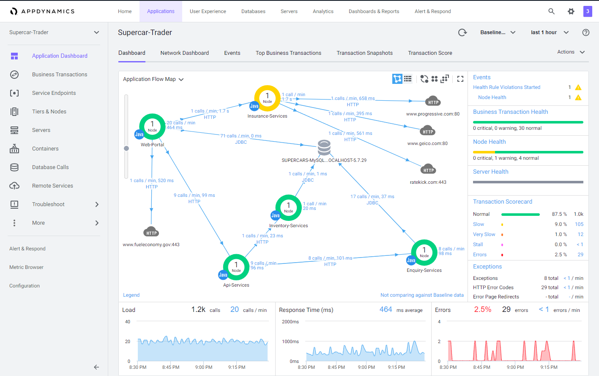
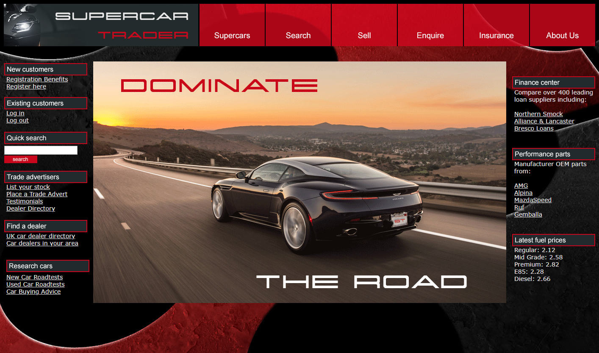

## Objectives 
In this Lab you learn how to use AppDynamics to monitor the health of your application services. You will need to complete this lab first before you start the other labs in this PoV Playbook.

When you have completed this lab, you will be able to:

- Download the AppDynamics Java APM Agent.
- Install the AppDynamics Java APM Agent.
- Initialize the sample application with load.
- Configure collection settings in the Controller.
- Monitor your application’s health.
- Troubleshoot application performance issues to find root cause.
- Monitor alerts in AppDynamic’s monitoring service based off of data captured by AppDynamics.

## Workshop Environment

The workshop environment has two hosts:

- The first host is where you installed the AppDynamics Platform and runs the AppDynamics Controller and will be referred to from this point on as the Controller VM.
- The second host runs the Supercar Trader application used in the labs. It will be the host where you will install the AppDynamics agents and will be referred to from this point on as the Application VM.

## Controller
You will be using the AppDynamics SE Lab Controller for this workshop. 
[AppDynamics SE Lab](https://se-lab.saas.appdynamics.com/controller/)

## Application VM
Supercar Trader is a Java-based Web Application

The purpose of Supercar-Trader collection is to generate dynamic traffic (business transactions) for AppDynamics Controller.

