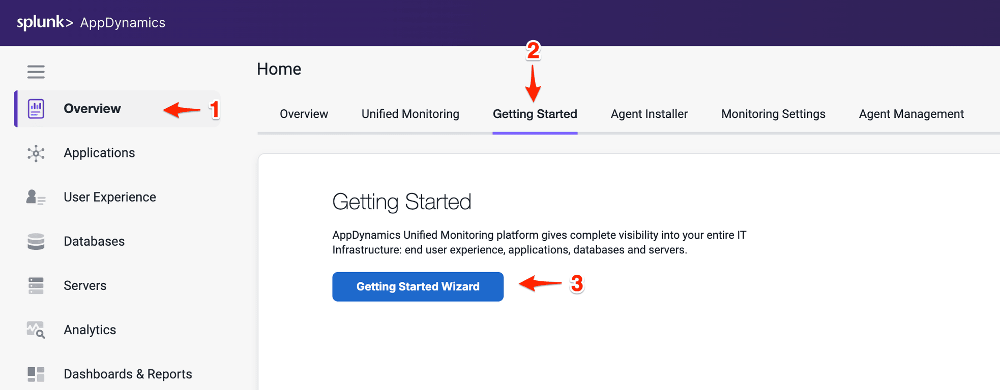
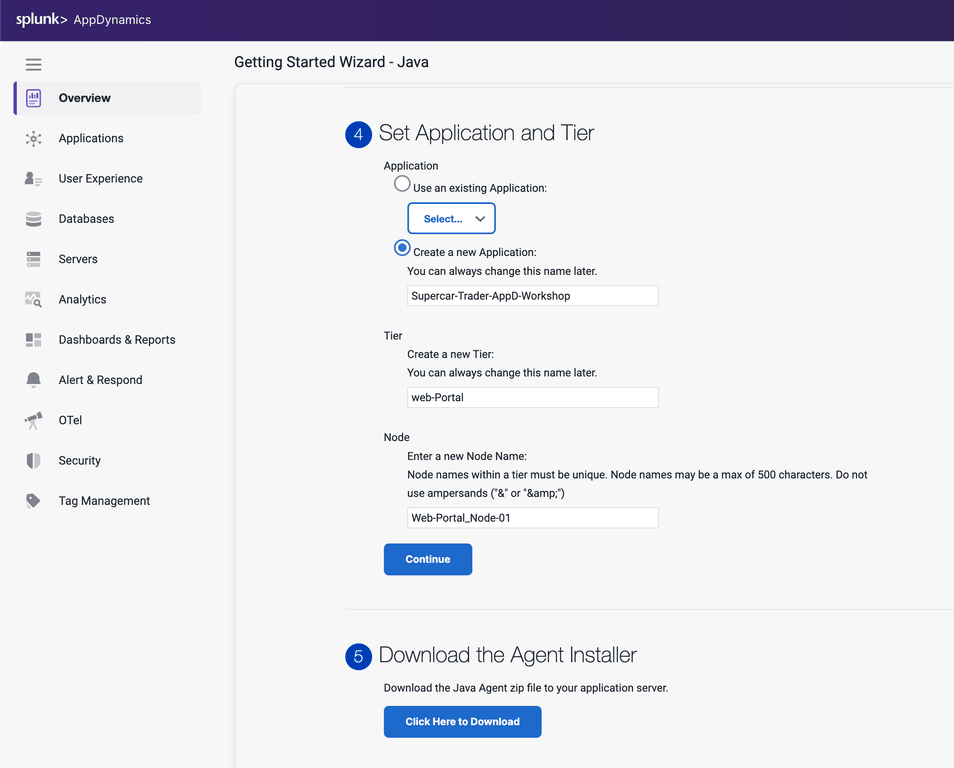

In this exercise you will access the AppDynamics Controller from a web browser and download the Java APM agent from there.

## Login to the Controller
Log into the [AppDynamics SE Lab Controller](https://se-lab.saas.appdynamics.com/controller/) using your Cisco credentials. 

## Configure your Application

1. Select **Overview** on the left navigation panel
2. Click on **Getting Started** tab
3. Click on **Getting Started Wizard** button 

  

Select the Java Application Type 
  

## Download the Java Agent

1. Select the **Sun/JRockit - Legacy** for the JVM type 
2. Accept defaults for the Controller connection.
3. Under **Set Application and Tier**, select **Create a new Application:**
4. Enter **Supercar-Trader-YOURINITIALS** as the application name. 
5. Enter **Web Portal** for the new Tier
6. Enter **Web-Portal_Node-01** for the Node Name
7. Click **Continue**
8. Click **Click Here to Download**.

{}
The application name must be unique, make sure to append your initials or add a unique identifier to the application name
{}

Your browser should prompt you that the agent is being downloaded to your local file system. Make sure to take note of where the file was downloaded to and the full name of it. 

