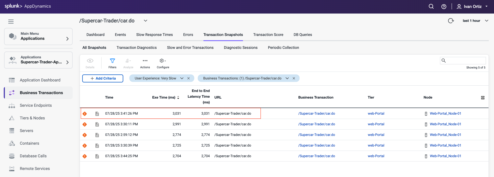
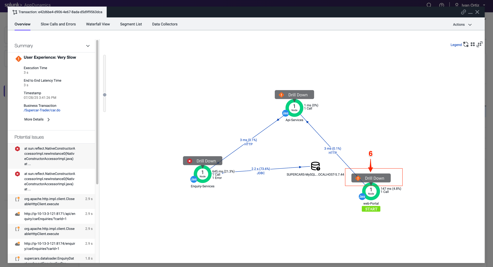
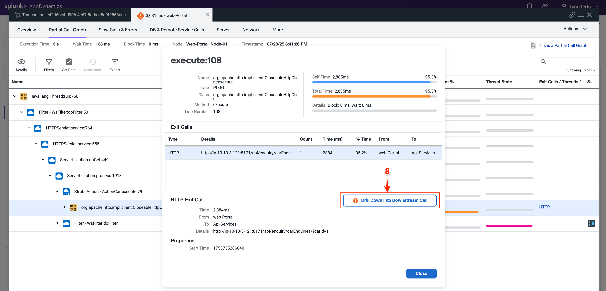
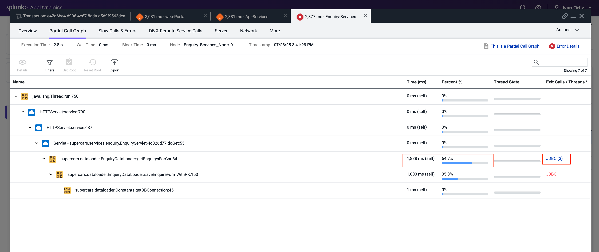

In this exercise you will complete the following tasks:

- Monitor the application dashboard and flow map.
- Troubleshoot a slow transaction snapshot.  

## Monitor the application dashboard and flow map

In the previous exercises we looked at some of the basic features of the Application Flow Map. Let’s take a deeper look at how we can use the Application Dashboard and Flow Map to immediately identify issues within the application.

1. Health Rule Violations, Node Health issues, and the health of the Business Transactions will always show up in this area for the time frame you have selected. You can click the links available here to drill down to the details.
2. The Transaction Scorecard shows you the number and percentage of transactions that are normal, slow, very slow, stalled, and have errors. The scorecard also gives you the high level categories of exception types. You can click the links available here to drill down to the details.
3. Left-click (single-click) on any of the blue lines connecting the different application components to bring up an overview of the interactions between the two components.
4. Left-click (single-click) within the colored ring of a Tier to bring up detailed information about that Tier while remaining on the Flow Map.
5. Hover over the time series on one of the three charts at the bottom of the dashboard (Load, Response Time, Errors) to see the detail of the recorded metrics.
  
  
  

Now let’s take look at Dynamics Baselines and options for the charts at the bottom of the dashboard.

1. Compare the metrics on the charts to the Dynamic Baseline that has been automatically calculated for each of the metrics.
2. The Dynamic Baseline is shown in the load and response time charts as the blue dotted line seen in the following image.
3. Left-click and hold down your mouse button while dragging from left to right to highlight a spike seen in any of the three charts at the bottom of the dashboard.
4. Release your mouse button and select one of the three options in the pop-up menu.

   
  

The precision of AppDynamics unique Dynamic Baselining increases over time to provide you with an accurate picture of the state of your applications, their components, and their business transactions, so you can be proactively alerted before things get to a critical state and take action before your end users are impacted.

You can read more about AppDynamics Dynamic Baselines [here](https://help.splunk.com/en/appdynamics-saas/application-performance-monitoring/25.7.0/business-transactions/monitor-the-business-transaction-performance/dynamic-baselines).  

## Troubleshoot a slow transaction snapshot
  
Let’s look at our business transactions and find the one that has the highest number of very slow transactions by following these steps.

1. Click the **Business Transactions** option on the left menu.
2. Click the **View Options** button.
3. Check and uncheck the boxes on the options to match what you see in the following image: 

   

4. Find the Business Transaction named /Supercar-Trader/car.do and drill into the very slow transaction snapshots by clicking on the number of Very Slow Transactions for the business transaction. 

{}
If the /Supercar-Trader/car.do BT does not have any Very Slow Transactions, find a Business Transaction which has some and click in the number under that column. The screenshots may look slightly different moving forward but the concepts remain the same.
{}
  
   

5. You should see the list of very slow transaction snapshots. Double-click on the snapshot that has the highest response time as seen below.  

   
  
When the transaction snapshot viewer opens, we see the flow map view of all the components that were part of this specific transaction. This snapshot shows the transaction traversed through the components below in order.

- The Web-Portal Tier.
- The Api-Services Tier.
- The Enquiry-Services Tier.
- The MySQL Database.

The Potential Issues panel on the left highlights slow methods and slow remote services. While we can use the Potential Issues panel to drill straight into the call graph, we will use the Flow Map within the snapshot to follow the complete transaction in this example.

6. Click on Drill Down on the Web-Portal Tier shown on the Flow Map of the snapshot.

   
  

The tab that opens shows the call graph of the Web-Portal Tier. We can see that most of the time was from an outbound HTTP call.

7. Click on the block to drill down to the segment where the issue happening. Click the HTTP link to the details of the downstream call.

   

The detail panel for the downstream call shows that the Web-Portal Tier made an outbound HTTP call to the Api-Services Tier. Follow the HTTP call into the Api-Services Tier.

8. Click Drill Down into Downstream Call.

   

The next tab that opens shows the call graph of the Api-Services Tier. We can see that 100% of the time was due to an outbound HTTP call.

9. Click the HTTP link to open the detail panel for the downstream call.
    
  

The detail panel for the downstream call shows that the Api-Services Tier made an outbound HTTP call to the Enquiry-Services Tier. Follow the HTTP call into the Enquiry-Services Tier.

10. Click Drill Down into Downstream Call.  

  

The next tab that opens shows the call graph of the Enquiry-Services Tier. We can see that there were JDBC calls to the database that caused issues with the transaction.

11. Click the JDBC link with the largest time to open the detail panel for the JDBC calls.

  

The detail panel for the JDBC exit calls shows the specific query that took most of the time. We can see the full SQL statement along with the SQL parameter values.

  

## Summary 

In this lab, we first used Business Transactions to identify a very slow transaction that required troubleshooting. We then examined the call graph to pinpoint the specific part of the code causing delays. Following that, we drilled down into downstream services and the database to further analyze the root cause of the slowness. Finally, we successfully identified the exact inefficient SQL query responsible for the performance issue. This comprehensive approach demonstrates how AppDynamics helps in isolating and resolving transaction bottlenecks effectively. 
