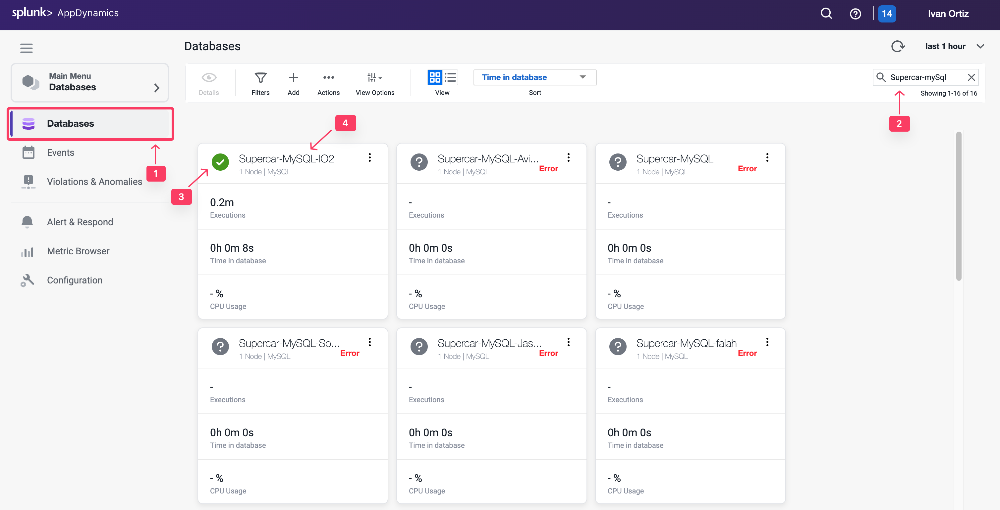

## Configure Database Collector

The Database Agent Collector is the process that runs within the Database Agent to collect performance metrics about your database instances and database servers. One collector collects metrics for one database instance. Multiple collectors can run in one Database Agent. Once the Database Agent is connected to the Controller one or more collectors can be configured in the Controller.

In this exercise you will perform the following tasks:

- Access your AppDynamics Controller from your web browser
- Configure a Database Collector in the Controller
- Confirm the Database Collector is collecting data

## Login to the Controller
Log into the [AppDynamics SE Lab Controller](https://se-lab.saas.appdynamics.com/controller/) using your Cisco credentials.

## Configure a Database Collector in the Controller

Use the following steps to change the settings for the query literals and navigate to the collectors configuration.

1. Click the **Databases** tab on the left menu.
2. Click the **Configuration** tab on the bottom left.
3. Uncheck the checkbox for **Remove literals from the queries**.
5. Click the **Collectors** option.

Use the following steps to configure a new Database collector.

6. Click **Add** button.
7. Select **MySQL** for the database type.
8. Select **DBMon-Lab-Agent** for the database agent and enter the following parameters.
9. Collector Name: **Supercar-MySQL-YOURINITIALS**
10. Hostname or IP Address: **localhost**
11. Listener Port: **3306**

12. Username: **root**
13. Password: **Welcome1!**

14. Select the **Monitor Operating System** checkbox under the **Advanced Options**
15. Select **Linux** as the operating system and enter the following parameters.
16. SSH Port: **22**
17. Username: **splunk**
18. Password: **Password Provided by Your Instructor to SSH into the EC2 Instance**
19. Click **OK** to save the collector.

## Confirm that the Database Collector is collecting data

Wait for ten minutes to allow the collector to run and submit data, then follow these steps to verify that the database collector is connecting to the database and collecting database metrics.

1. Click the **Databases** tab on the left menu
2. Search for the Collector created in the previous section: **Supercar-MySQL-YOURINITIALS**
3. Ensure the status is green and there are no errors shown.
4. Click the Supercar-MySQL link to drill into the database.

_Note: It may take up to 18 minutes from the time you configure your collector to see the Top 10 SQL Wait States and any queries on the Queries tab._

You can read more about configuring Database Collectors [here](https://docs.appdynamics.com/appd/24.x/latest/en/database-visibility/add-database-collectors)